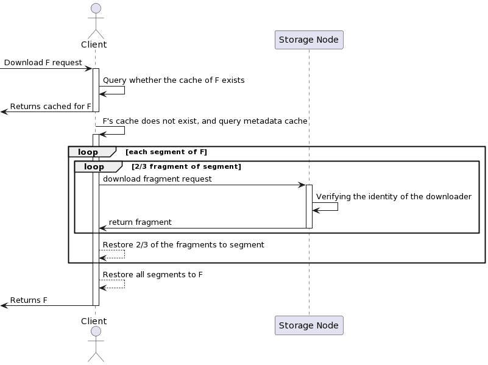

# Process Flow

This section introduces the data download process from the CESS network.

The data in the CESS network is free and open to all users. Once your data is uploaded to CESS, it can be downloaded through a simple HTTP GET request. Before downloading, users should check to see if the data status is **ACTIVE**. Otherwise, the download could fail. If it is encrypted data, users will be prompted to enter a key for decryption.

The following figure shows the detailed process of data download. The client only needs to download 2/3 fragments of each segment and concatenate all segments together to recover the original data.

