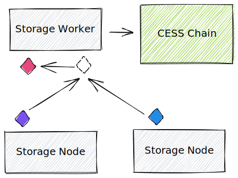
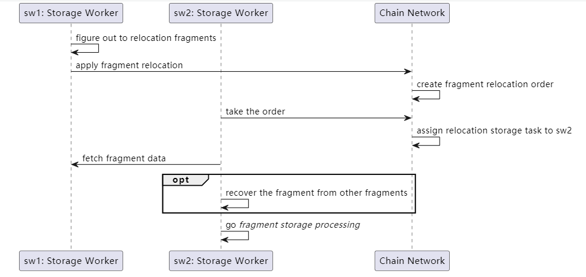

# Process Flow

A complete restore mechanism for active data is in place based on fragments redundancy technology to ensure user data availability and the miners' rights.

# Restore Mechanism

Each file is first divided into segments with the exact specifications. Then each file segment is sliced into fragments for redundancy, and the resulting fragments are stored on different storage nodes. With the 1.5 times redundancy rule, as long as the number of missing or damaged fragments in any segment does not exceed 1/3, the network can restore the file based on other fragments.

# Miner Self-check

Miners who fail the audit do not receive rewards, and those who consecutively fail their staked asset will be slashed. Miners can manually conduct self-check, or the mining machine can trigger self-check after a random challenge verification failure to protect their assets. Self-check will compare all idle and active data fragments stored locally and screen out non-compliant data fragments based on the meta information on-chain. Idle data fragments will be discarded directly, and a transaction will be triggered to delete the corresponding idle data. For active data fragments, miners will first attempt to restore the data using the node restoration mechanism. If restoration fails, a transaction will be triggered to generate a restore order.

# Restore Target

Whether voluntarily or passively quitting mining, miners need to transfer their currently stored active data to other miners, and a restore target will be created for this miner's account for public disclosure. Because there may be too much active data to restore, a restore order must not be issued from the blockchain. Other miners will search for active data stored in the restore target and initiate transactions to issue restore orders.

After all the active data in the restore target have been transferred to other storage nodes, the target can be disconnected from the network with a disconnection message broadcast.

# Restore Order

Restore orders are all restore tasks currently being executed on the network with two statuses: **Claimed** and **Unclaimed**. Only miners can issue restore orders, and the issuance conditions are as follows:

- Must be for active file fragments.
- The order currently does not exist on the network.
- The issued target must be one of the current restore targets or the node itself.

When the issued order is the node itself, it will be changed to an `unclaimed` state after generation, waiting for other miners to pick it up. When the issued order is another restore target, the order will be updated to a `claimed` state.

If a miner fails to complete the restore order, its `claimed` status will be changed back to an `unclaimed` state within a validity period and wait for other miners to claim it again.

Meanwhile, only one miner can claim an order and perform the restore task. During the restore process, the miner will prioritize transferring active file fragments and tags stored on the restore target. If the transfer fails, it will try to restore the file fragments by downloading them from other miners to construct the segment.

# Restore Report

After completing the restore task, the miner must call a transaction within the validity period to report the restore results on-chain before the restore task is considered complete. Then the miners' storage power will be increased, and the corresponding meta information of the file will be updated.

# File Loss

When a restore order is generated, the network will check the current status of the corresponding data segment. If more than 1/3 of its file fragments are under restoration, the data will be marked as `suspected lost`, and a count-down task will be triggered. When the task ends, and the file segment still has more than 1/3 of file fragments under restoring, the file will be marked as `lost`.

The current count-down interval is set to **three times the required time of the restore order execution**.
