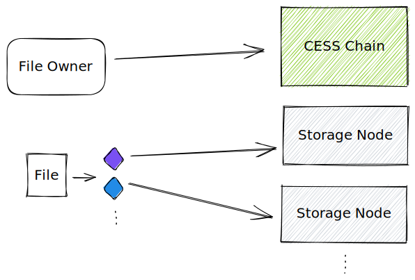
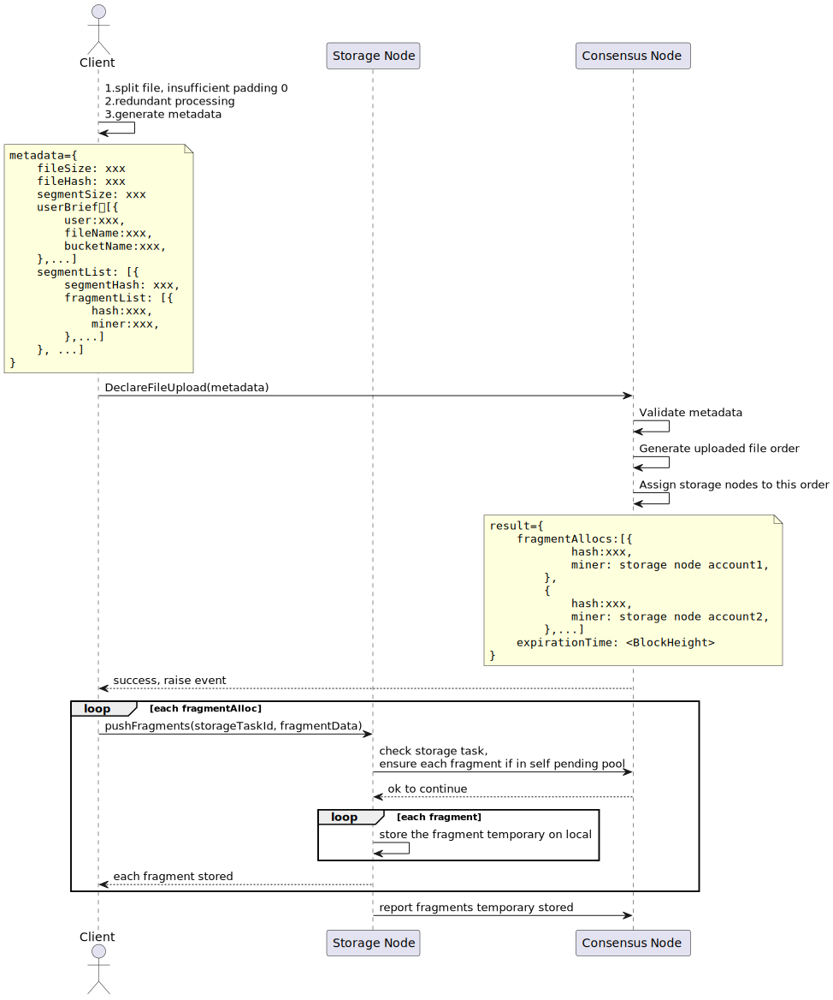

# Process Flow

This section introduces the data upload process to the CESS network.

When you upload data to CESS, it goes through an erasure coding technology (based on [Reed-Solomon Error Correction](https://en.wikipedia.org/wiki/Reed%E2%80%93Solomon_error_correction)) and is divided into fixed-size fragments. These fragments are then distributed to storage nodes in the network.

# Summary

To upload data to the CESS network, users must perform the following steps:

1. Rent storage space
2. Authorize the space usage rights to [**DeOSS**](https://docs.cess.network/deoss)
3. Create a bucket if needed
4. Upload data to DeOSS
5. Check the on-chain data status based on the returned transaction hash

For detailed steps, please refer to the [DeOSS guide](https://docs.cess.network/deoss).

# Upload Process

The following figure shows the detailed data upload process. The metadata includes the client's calculated data size, hash, segmented list, redundant list, owner's account, data bucket information, etc. The client first issues a storage order on-chain. Then the network allocates storage nodes to store data. Next the client obtains the result processed by the network by listening to events. The result contains the storage nodes corresponding to each fragment, and the client needs to store all fragments in these storage nodes:

When uploading data, users can choose whether to encrypt the data. If encryption is required, the user must also provide the encryption key. The SDK uses the key entered by the user for encryption. The SDK does not keep the user key. So users need to keep the key properly, or else the data cannot be decrypted.

When the user receives the data hash, the data may still need to be stored on the storage node in the CESS network. Only when the data status changes to ACTIVE does the data have been successfully stored.
