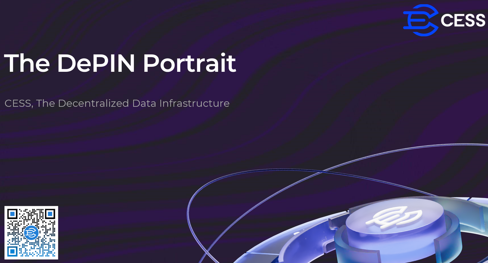

# The DePIN Portrait
Over the past few decades, we have witnessed a remarkable evolution of the internet. From the early days of Web 1.0, which was primarily "read-only," to the more interactive and participatory Web 2.0, which brought us social media, e-commerce, and a new era of digital communication. However, this rapid development has not come without its challenges.

Today, we’re standing on the brink of Web 3.0, the forefront of a digital transformation that’s reshaping how we think about data, storage, and computing. In a world where information is power, the way we handle, store, and share that information has become critical.

<figure><figcaption>
The Dawn of the New World
</figcaption></figure>

Decentralized platforms offer us a new way forward—one that prioritizes transparency, user control, and resilience. With decentralized storage and computing, we can ensure that data remains accessible yet secure, distributed yet reliable, and, above all, owned by those who create and contribute it. Today, we’ll dive into how decentralized technology is transforming storage and computing and why this shift matters now more than ever.

**DePIN is the key answer to the next Web.**

## Understanding DePIN
As we progress into the Web 3.0 era, it's crucial to understand the role of Decentralized Physical Infrastructure Networks, or **DePIN**. DePIN represents a transformative shift in how we approach the development and management of infrastructure that underpins digital ecosystems. Unlike traditional, centralized systems that are controlled by a single entity, DePIN leverages the power of decentralization to create a network of resources—be it storage, computation, or content delivery—spread across a vast array of independent nodes. This ensures that no single point of failure can compromise the integrity or availability of the services provided.

<figure><figcaption>
DePIN
</figcaption></figure>

## DePIN Advantages compared to centralized infrastructure
Let’s take a look at the key advantages that DePIN, or Decentralized Physical Infrastructure Networks, offer over traditional centralized infrastructure.

<figure><figcaption>
DePIN Advantages
</figcaption></figure>

Firstly, **Security & Privacy**: In a decentralized setup, data is encrypted and spread across multiple nodes, which helps prevent single points of failure and reduces the risk of data breaches. This means data is safer and more resilient to attacks.

Next, **Transparency & Trust**: With DePIN, all data transactions are verifiable on-chain. This ensures a high level of transparency, as every transaction can be traced and validated, which builds trust in the network.

**Resilience & Reliability** is another critical advantage. Decentralized networks distribute data across various nodes, providing a higher fault tolerance. This makes the system more robust and reliable, as it can handle disruptions better than centralized systems.

Finally, **User Empowerment & Data Sovereignty**: DePIN gives users complete control over their data. Unlike centralized models where data is controlled by a single authority, users in a decentralized network have true ownership and can decide how their data is used, achieving full data sovereignty.

In summary, DePIN not only enhances security and transparency but also brings greater resilience and empowers users by giving them control over their data. These advantages make it a powerful foundation for the next generation of digital infrastructure.

## Core Components of DePIN
Let’s dive into the components that make up DePIN, and some DePIN projects, and understand how they work together to power a next-generation web.

CESS believes that DePIN will be the foundation of the Next Generation of the Internet. We can simply divide DePIN into **De-Networks** and **PIN-Networks**.

<figure><figcaption>
Components of DePIN
</figcaption></figure>

**De-Networks (Decentralized Networks)** include but are not limited to: L1 Chain, X-Hub, Wallet, Primitives, Infra Module and other components.

**PIN-Networks (Physical Infrastructure Networks)** include but are not limited to: Compute Networks, Storage Networks, Backbone Networks and Energy Networks and other components.

At the top, we have the **Service Networks**. These networks represent various sectors where DePIN can drive transformation. For example, industrial networks, agricultural networks, government, financial, and health networks can all leverage decentralized infrastructure to enhance transparency, efficiency, and security. This layer is where DePIN’s impact on real-world applications truly shines, enabling services that benefit industries globally.

Together, these elements of DePIN not only support decentralized services and applications but also create a robust, adaptable ecosystem that is prepared for the demands of the future. With these components, DePIN is positioned to redefine infrastructure for a truly decentralized digital economy.

## DePIN Sector Map
Let's dive into the details of DePIN. DePIN encompasses various subcategories that address different aspects of our digital infrastructure. Let's first divide it into two parts, Decentralized Networks and Physical Infrastructure Networks. 

<figure><figcaption>
DePIN Sector Map
</figcaption></figure>

### Decentralized Networks

There are two types of Decentralized Networks: Blockchain and Protocols.

#### Blockchain

##### L1 Chain

The L1 chain in DePIN serves several important functions.

- Decentralization and Trust
It provides a decentralized ledger to record transactions related to physical infrastructure usage and ownership. For example, in a DePIN for energy sharing, it can record the generation and consumption of electricity between different households without the need for a central authority to validate and oversee. This builds trust as the records are immutable and transparent, and all participants can access and verify the data.

- Security and Immutability
Ensures the security of data and transactions. Once a transaction is recorded on blockchain, it's extremely difficult to alter. In a DePIN for a logistics network, the movement and ownership transfer of goods can be securely logged, protecting against fraud and unauthorized access.

- Incentive Mechanisms
Facilitates the distribution of rewards and incentives. Tokens can be used to compensate users who contribute resources such as bandwidth (in a network-based DePIN) or storage space (for a data-related DePIN). The blockchain layer manages the accounting and transfer of these tokens in a transparent and efficient manner.

Examples: [CESS](https://cess.network), [Ethereum](https://ethereum.org/?ref=cess.network), [Solana](https://solana.com/?ref=cess.network)

##### X-Hub
- Interoperability
It enables different DePINs or blockchain - based systems to interact and share data. For example, a DePIN for energy infrastructure on one blockchain can communicate with a DePIN for transportation infrastructure on another blockchain. This allows for a more comprehensive and integrated utilization of physical infrastructure resources across different domains.

- Asset Transfer
Facilitates the transfer of assets such as tokens between different blockchain networks. In a DePIN context, it could mean the transfer of value - representing tokens (used for incentivizing infrastructure contributions) from one blockchain-based DePIN ecosystem to another. This broadens the scope of asset utilization and investment opportunities.

- Scalability and Resource Sharing
Different blockchains may have different strengths in terms of processing power, storage, and user base. X-Hub technology allows DePINs to leverage the resources of multiple chains. For example, a DePIN project that requires high-speed transaction processing can utilize the capabilities of a blockchain known for its fast-paced transactions through X-Hub connections, while also accessing the storage capabilities of another blockchain for data-related to physical infrastructure.

Examples: [Polygon](https://polygon.technology/?ref=cess.network), [Cosmos](https://cosmos.network/?ref=cess.network)

##### IOT

- Data Collection and Aggregation
The IoT network platform serves as a hub for gathering data from a vast array of physical devices. For example, in a smart city-based DePIN, it can collect information such as traffic flow data from sensors on roads, energy consumption data from smart meters in buildings, and environmental data like air quality readings from various monitoring devices. This data is then aggregated and organized in a way that can be further processed and utilized.

- Device Management and Connectivity
It manages the connection and communication of IoT devices. The platform ensures that different types of devices with different communication protocols can interact with each other and with the overall DePIN system. For instance, it can handle the connection of a legacy industrial sensor that uses an older communication standard with a new-generation smart grid device, enabling seamless data flow and coordination.

-  Real-Time Monitoring and Control
Provides the ability to monitor the status of physical infrastructure in real - time. In a DePIN for a distributed energy system, operators can use the IoT platform to instantly observe the performance of solar panels, wind turbines, and energy storage systems. Moreover, it also allows for remote control of these devices to some extent. For example, adjusting the output of a solar inverter or the charging rate of a battery storage unit based on real-time energy demand and supply conditions.

-  Data Standardization and Interoperability
Ensures that the data collected from diverse IoT sources is in a standard format. This is crucial for the interoperability of different components within the DePIN. By standardizing data, it becomes easier to share and integrate information across different applications and services. For example, the same air quality data collected by the IoT platform can be used by both a local government's environmental protection department for policy-making and by a healthcare institution to assess the impact on public health.

Examples: [IoTeX](https://iotex.io/?ref=cess.network), [peaq](https://www.peaq.network/?ref=cess.network)

#### Protocols

##### ZkTLS

zkTLS (Zero - Knowledge Transport Layer Security) provides a high level of privacy for data in transit. it provides a high level of privacy for data in transit, enables secure authentication of devices and users, and facilitates trustless data sharing between different nodes or entities in the DePIN ecosystem. 

Examples: [clique](https://www.clique.tech/?ref=cess.network), [opacity](https://www.opacity.network/?ref=cess.network)

##### Staking

Staking helps in securing the network. It serves as an incentive for users to contribute physical infrastructure resources, and provides users with governance power. 

Examples: [glif](https://www.glif.io/?ref=cess.network)

### Physical Infrastructure Networks

#### Compute Networks

##### General Purpose

The General Purpose Compute network usually acts as a provider of computing resources. It's responsible for the execution and scheduling of computational tasks and provides compatibility and interoperability between different software and hardware components. 

Examples:  [aethir](https://aethir.com/?ref=cess.network), [flux](https://runonflux.io/?ref=cess.network)

##### AI, ML, ...
This kind of Networks platform  well-suited for parallel computing, and the distributed GPUs platform can be a powerful resource for AI-training and machine-learning algorithms and data-analytics tasks in DePIN. 

Examples: [io.net](https://io.net/?ref=cess.network)

#### Storage Networks

##### File System

- **Data Storage and Redundancy**
The primary function is to store data. In a DePIN for a smart city, it can hold vast amounts of data such as traffic camera footage, energy consumption records of buildings, and environmental sensor readings. The distributed nature of the system provides redundancy. Data is replicated and stored across multiple nodes. For example, if one storage node fails due to a hardware malfunction or a natural disaster, the data can still be retrieved from other intact nodes, ensuring data availability and durability.

- **Decentralized Data Management**
It enables decentralized data management. Instead of relying on a central data center, the distributed file system in DePIN allows different participants in the network to have a degree of control over the data. For instance, in a DePIN for a peer - to - peer energy trading network, homeowners can manage the storage and sharing of their own energy - production and - consumption data. This decentralization also enhances data security as there is no single point of failure or control.

- **Scalability**
The distributed file system can easily scale to meet the growing demands for data storage. As more devices and applications are added to the DePIN, more storage space is needed. The system can accommodate this by adding new storage nodes. For example, in a DePIN for an Internet of Things (IoT) - based logistics network, as the number of tracked packages and associated data (such as location, temperature, and humidity) increases, the distributed file system can expand to store all the additional information.

- **Data Privacy and Ownership**
It helps in maintaining data privacy and clarifying data ownership. In a DePIN for a healthcare system, patients' medical records can be stored in a distributed manner. The patients have more control over who can access their data and under what conditions. The system can use encryption and access - control mechanisms to ensure that only authorized parties can view or modify the data, respecting the privacy and ownership rights of the data owners.

Examples: [CESS](https://cess.network), [filecoin](https://filecoin.io/?ref=cess.network), [storj](https://www.storj.io/?ref=cess.network)

##### Database

The decentralized distributed databases ensure data consistency and integrity by their consensus Algorithms and conflict resolution mechanisms. They support concurrent operations, allow multiple users or applications to access and modify the data simultaneously. These types of databases offer great scalability to easily meet DePIN’s growing needs.

Examples: [polybase](https://polybaselabs.com/?ref=cess.network), [tableland](https://tableland.xyz/?ref=cess.network)

#### Transmission Networks

##### Mesh
The distributed mesh network provides highly robust and reliable connectivity. There is no single point of control or a central hub that all communication must pass through. The mesh networks have redundancy and fault-tolerance mechanisms. 
For example, in a city-wide environmental monitoring system, even if one or several links between CESS nodes are disrupted due to physical damage or interference, the CESS CD²N can reroute data through alternative paths. This ensures that the data from air quality sensors, noise monitors, and other devices continues to flow without interruption, maintaining the integrity of the monitoring system.

#### Energy Networks

The distributed energy networks enable the integration of multiple energy sources and will be responsible for distributing the power efficiently. In a DePIN setting, it can incorporate renewable energy sources such as solar panels, wind turbines, and small-scale hydroelectric generators. The distributed energy networks can determine the optimal times to store energy, such as when there is excess generation from renewable sources, and release it when the demand is high or during grid-instability. And, it will complete the Data Collection and Analytics for Optimization in these processes.

Examples: [emerson](https://www.emerson.com/?ref=cess.network)

......

We are very sure that among the many projects summarized on this DePIN Sector Map, there are some you’re familiar with and others you may not know as well. Moreover, this map is incomplete, and many excellent projects are not included. Moreover, we believe that as time goes by, more and more great projects will be added to this map to build our future together.

## What's CESS doing in DePIN
Having explored the general definition and development of DePIN, the question remains: how can a DePIN project use innovative technology to create tangible benefits for industries, organizations, and individual users?

Let’s see how CESS does it.

### Decentralized storage

Decentralized storage is the foundation of DePIN. Unlike traditional storage solutions that rely on centralized servers, decentralized storage distributes data across multiple nodes in a network. We use a blockchain-powered infrastructure to offer secure and scalable storage solutions. By distributing data across numerous nodes globally, CESS not only increases data availability but also ensures that users retain full ownership and control of their data. This makes it a perfect fit for the Web3 era, where data sovereignty is key.

### Decentralized Content Delivery Network 
And Decentralized Content Delivery Network is also crucial for efficiently delivering content across the web. Unlike traditional CDNs that rely on centralized data centers, decentralized CDN leverages a distributed network of nodes to deliver content. This approach reduces latency, increases speed, and ensures content is accessible even during outages or attacks. CESS’s CD²N takes this concept further by integrating it with its decentralized storage. By utilizing the same global network of nodes, CESS ensures that content is delivered quickly and securely, without the bottlenecks associated with traditional, centralized CDNs. This is particularly beneficial for applications that require high-performance content delivery, such as video streaming and large-scale data distribution. We provide highly-customizable solutions for users who have large-scale data needs. For example, you can choose where your data is stored and distributed.

### Decentralized computing 
Decentralized computing is the next frontier, where computational tasks are distributed across a network rather than being handled by a central server. When combined with AI, this allows for the development of robust, scalable AI applications that are not reliant on centralized infrastructure. CESS is at the forefront of AI and blockchain integrations with our innovative AI-LINK. This component allows for collaborative AI model training across the network, without sharing raw data. This ensures that data privacy is maintained while still harnessing the collective computational power of the network. 

## CESS Architecture
CESS architecture is designed for decentralized efficiency. We have multiple interfaces—CLI, RPC, API, and SDK—enabling flexible access. Our Protocol Suite includes the Distributed Content Delivery Layer with cache and retrieval nodes for fast data delivery, and the Distributed Storage Resource Layer with storage and consensus nodes to ensure data reliability. CESS’s blockchain layer supports smart contracts, data ownership (MDRC), data availability, and our consensus algorithms PoIS and PoDR², providing a secure foundation for Web3.

<figure><figcaption>
CESS Architecture
</figcaption></figure>

## Innovative Technologies in CESS 
CESS brings several innovative technologies into play:

<figure><figcaption>
CESS Innovative Technologies
</figcaption></figure>

- Random Rotational Selection (R²S) is a consensus mechanism to achieve lower gas fees and higher transaction processing speeds (10,000 TPS)  and maximum decentralization among network nodes. Process, transact and share your data in a Trusted Execution Environment (TEE). 
- Proof of Data Reduplication and Recovery (PoDR²) is atrustless solution that verifies the authenticity of your data. PoDR² continuously challenges storage nodes to prove data validity and availability. Recovery functionality will prevent data loss and guarantee data integrity when storage nodes quit the network and enter the data cooling period.
- Proof of Idle Space (PoIS), is a mechanism introduced by CESS to certify, verify, and manage idle space on storage nodes. The proof of idle space organizes idle data into files and uses a Merkle hash tree to verify the integrity of each idle file.
- Proxy Re-encryption Technology (PReT) enables secure sharing of encrypted data among authorized parties. A public key encryption technology that allows users to authorize decryption permissions to others without revealing data content.
- Multi-Format Data Rights Confirmation (MDRC): Fingerprints are extracted from all data and permanently stored on-chain via smart contracts for traceability. Similar duplication can be discerned to confirm originality.
- CESS AI-LINK is a Byzantine-robust circuit designed to protect user privacy and data sovereignty, allowing participants in each CESS node to collaboratively train a shared model without sharing their original data.

## What CESS Offers

<figure><figcaption>
What CESS Offers
</figcaption></figure>

- **Data Sovereignty and Privacy**: Blockchain-based encrypted storage technology provides secure data access to the data owner for privacy and control.
- **Location-Based Storage**: Customizable data storage locations allow data management and regulation compliances (GDPR, HIPPA…)
- **Responsible AI with Privacy**: Traceable multi-party AI model training without exposing their original data.
- **Massive Storage Capacity**: Enterprise-level storage solutions that are decentralized and cost-effective, utilizing global idle resources to provide limitless capacity.
- **Blockchain-Based Disaster Recovery**: Storage-Proof mechanism safeguards the integrity and availability of nodes against potential losses of up to 66%.
- **Fast Data Retrieval**: Decentralized data framework facilitates data access and processing in milliseconds.

## The Future
Let’s take a look at what the future holds with DePIN and the transformative potential it offers in several key areas.

DePIN is going to shift power from centralized entities to individuals. In today’s digital world, much of our data is controlled by a few major corporations. DePIN changes that by giving people the opportunity to own, control, and monetize their data without relying on intermediaries. This empowerment enables individuals to fully participate in the digital economy, benefiting from the value that their data generates.

With DePIN, we’re building a decentralized foundation for a safer internet. Centralized networks are prone to single points of failure, making them vulnerable to data breaches and cyberattacks. By decentralizing data storage and infrastructure, DePIN enhances security across the board. Each node in the network contributes to data redundancy and security, ensuring that no single entity holds all the power or responsibility. This approach leads to a more resilient internet, where data integrity and privacy are foundational elements.

DePIN presents a unique opportunity for those who embrace it early to lead the charge in the next generation of internet infrastructure. Countries and organizations that adopt decentralized infrastructure can position themselves as pioneers in data sovereignty, privacy protection, and digital independence. This is an opportunity for global leadership, showing the world what a fair and transparent digital ecosystem can look like. DePIN gives us a framework to build a future where innovation and ethics go hand in hand.

We need to admit that DePIN’s success depends on a collective effort. To realize the potential of a decentralized internet, we need support from stakeholders across various sectors—governments, enterprises, developers, and users. Each group has a role to play in shaping a fair, accessible, and open infrastructure. Governments can create supportive policies, enterprises can innovate with decentralized technology, and users can adopt DePIN solutions in their daily lives. By working together, we can build a strong ecosystem that drives positive change.

In summary, the future with DePIN is one that prioritizes empowerment, security, collaboration, and leadership. By embracing DePIN, we are setting the stage for a decentralized future that benefits everyone involved in the digital ecosystem.

<figure><figcaption>
The Future with DePIN
</figcaption></figure>

## Ending
DePIN offers a powerful vision for the future—one where individuals are empowered, the internet is more secure, collaboration drives innovation, and global leadership embraces ethical technology. By investing in and supporting decentralized infrastructure, we are collectively building a digital ecosystem that respects data sovereignty and privacy, and that ultimately serves everyone, not just a select few.

<figure><figcaption>
The DePIN Portrait
</figcaption></figure>

We hope that CESS can contribute to this vision for all mankind.

