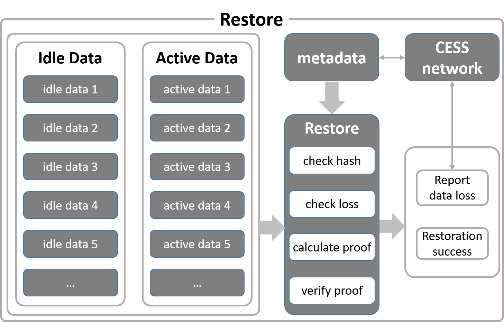


Work in Progress


There are three strategies for flexible backup restoration:

1. **Manual Restore Strategy**: Users start the restore function by executing the `bucket restore` command. The storage node only verifies the hash value of the data by default. It can also enable proof verification through the `--proof` command option. In `--proof` mode, the storage node will also generate proof for the data and conduct self-verification. For data with incorrect hash values, failed proof self-verification, or partial loss, the storage node will first download the data from the network and attempt to pass its self-verification. If the self-verification fails, the network data lost will be reported. Reporting data lost does not penalize the storage node.

2. **Scheduled Restore Strategy**: The restore function is automatically executed internally through the storage node service. It is the same as running the `bucket restore` command.

3. **Event Listening Strategy**: This data restore strategy is triggered by listening to the penalty events. When a data proof of a storage node fails verification, the network will slash the storage node. When a storage node receives its own slashing event, it will immediately start the restore strategy for its data, and the restoring process is the same as running the `bucket restore` command.

