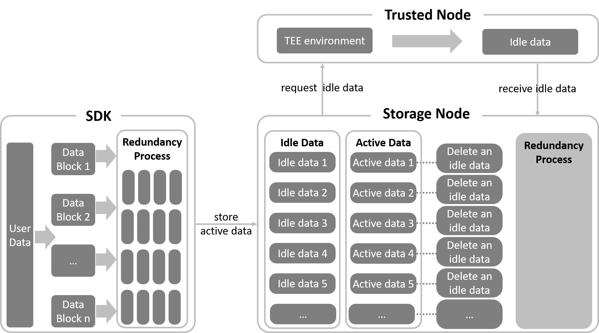

The data in the CESS network can be divided into **idle data** and **active data**. Trusted nodes in the TEE environment generate idle data and then passed to storage nodes to fill their available storage space. As a result, the actual available space of the storage nodes is proven. Active data is the data uploaded by users, which is processed and ultimately stored in storage nodes. Once a storage node stores the (user) active data, the data status is changed to **active**.

Meanwhile, idle data of the storage node needs to be selected for deletion. Replacing idle data with active data is known as idle-active replacement. It also encourages the storage node to store more active data to earn more rewards.

The following figure shows the data storage of these two types of data in the CESS network:

- **Idle Data**: Data that storage nodes request for trusted nodes. It is generated in the TEE environment and returned to the storage node.

- **Active Data**: It is a data slice uploaded by users, processed by the SDK, and programmed with uniform specifications of the same size as the idle data. Upon handing over, the storage node randomly deletes idle data to store the active data.

