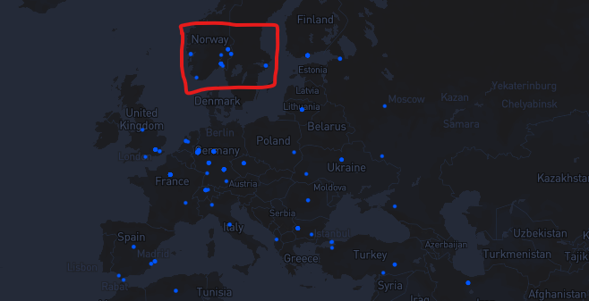
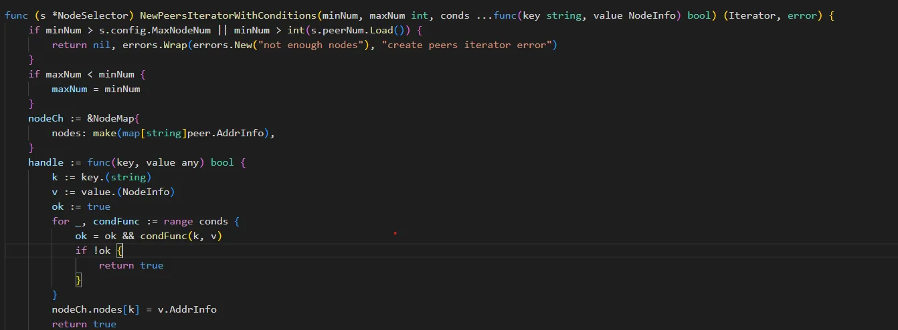

## **LBSS of CESS Network: A New Paradigm for Data Sovereignty and Compliance in the AI Era**

*2025-04-02 by **CESS Research Institute*** 

### **Introduction**

As industries across the globe increasingly adopt AI and machine learning, the need for secure, scalable, and highly performant data infrastructure is more critical than ever. Data is central to the development and operation of AI systems, but managing it across a diverse range of regulatory environments, geographical boundaries, and data privacy standards presents a significant challenge.

One of the key obstacles in managing AI data is ensuring **data sovereignty** and **regulatory compliance** while simultaneously meeting the performance requirements of modern AI applications. These applications often require access to vast amounts of real-time data, while data protection regulations such as **General Data Protection Regulation (GDPR)** in the EU, **Health Insurance Portability and Accountability Act (HIPAA)** in the US, and China’s **Cybersecurity Law** impose stringent rules on how and where data can be stored, processed, and shared.

The **LBSS (Location-Based Storage Selection)** feature within the **CESS Network** aims to address this challenge by offering businesses the ability to store their data in specific geographic regions in a way that balances compliance with performance and cost considerations. This article explores the technical details of the LBSS feature, the algorithms behind it, and its application in real-world AI scenarios.
<figure><figcaption>
LBSS
</figcaption></figure>

---

### **The Need for LBSS**

AI applications today are highly dependent on access to vast datasets. However, these datasets often include sensitive personal or proprietary data that must be stored and processed in compliance with varying national and international regulations. 

For instance:
- **GDPR** mandates that personal data of EU citizens must be stored and processed within the EU unless specific conditions are met.
- **HIPAA** requires healthcare data to be stored in compliance with strict privacy protections in the US.
- **Cybersecurity Law** stipulates that certain data (particularly that related to Chinese citizens) must remain within China’s borders.

Simultaneously, AI models rely on **low-latency access** to data in order to perform real-time processing and decision-making, such as in the case of autonomous vehicles, financial fraud detection, and predictive maintenance in industrial settings. These systems need to be able to fetch data quickly from storage locations that are geographically close to the point of application.

Finally, cost is another crucial consideration. Storing data in certain geographic regions may incur significantly higher operational and energy costs, as well as transaction fees. For example, data centers in Europe and North America are typically more expensive to operate than those in regions like Southeast Asia, where electricity costs are lower.

Thus, the ability to **dynamically select storage locations** that meet compliance, performance, and cost requirements is essential for AI applications. CESS’s **LBSS** feature addresses this multifaceted challenge by offering a **programmable, dynamic solution** that optimizes data storage across regions while maintaining compliance and performance.

---

### **How LBSS Works in CESS Network**

The **LBSS** feature in CESS Network combines **decentralized data storage** with advanced algorithms to determine the most optimal geographic region for storing data based on a combination of factors:

1. **Compliance with Regulatory Frameworks**: Ensuring that data is stored within the correct jurisdiction in accordance with local data sovereignty laws.
2. **Latency**: Reducing the time it takes for data to be retrieved by AI systems to ensure real-time or near-real-time access.
3. **Cost Efficiency**: Minimizing operational costs, including storage and transaction fees, by selecting the most cost-effective regions.

#### **1. Compliance Factor**

The compliance factor in LBSS ensures that data storage decisions are made in accordance with legal requirements. Each region has different **data residency** laws, and the algorithm evaluates these regulations to ensure that data is stored in compliance with **national and international data protection laws**. 

##### **Regulatory Considerations**:
- **GDPR**: Data involving EU citizens must remain within the EU unless certain conditions (e.g., data anonymization or encryption) are met.
- **HIPAA**: Data related to healthcare and medical records in the US must be stored with high levels of security and specific encryption standards.
- **Local Data Sovereignty Laws**: Many countries, including Russia, China, and Brazil, have strict rules that require data about their citizens to be stored domestically.

The **compliance score**  ($$C_{compliance}(L, D) $$) is a key parameter in the LBSS decision-making process and reflects the legal alignment of a storage location with the relevant jurisdiction’s laws. The algorithm dynamically adjusts its compliance checks based on the dataset’s associated legal framework, guiding the selection of the most appropriate storage region.

#### **2. Latency Factor**

AI applications often require **real-time data access** for decision-making. To minimize data retrieval times, the LBSS algorithm calculates the **latency** associated with each potential storage location. 

##### **Latency Calculation**:
The latency function, denoted as ( $$T_{latency}(L, D) $$), measures the round-trip time for data to travel between the storage location $$L$$ and the user or AI model requesting the data. In the context of AI applications, low-latency access is essential for use cases like:
- **Autonomous vehicles** (which require near-instantaneous data to make driving decisions).
- **Real-time fraud detection** (which must access transaction data in milliseconds).
- **Healthcare applications** (which use AI to process medical data and provide diagnosis recommendations in real-time).

The LBSS system takes into account the **physical proximity** of data centers to users or applications to minimize latency, and if multiple storage locations are available, it prioritizes the closest ones. This ensures that AI models can process real-time data quickly and efficiently, improving performance and user experience.

#### **3. Cost Factor**

Storing data in some geographic locations can be more expensive than others due to factors like energy costs, infrastructure expenses, and transaction fees. For example, storing data in the **US** or **EU** often comes at a premium compared to data centers in **Asia** or **Latin America**.

The cost factor $$C_{cost}(L, D)$$ calculates the total cost of storing data in a particular location $$L$$. This includes factors such as:
- **Operational costs**: These may vary based on the infrastructure requirements and energy consumption in the data center.
- **Transaction fees**: Blockchain-based systems like CESS often involve transaction fees for data retrieval and storage, which can differ between regions.

The LBSS algorithm seeks to minimize $$C_{cost}(L, D)$$, selecting storage locations that balance the legal and latency requirements with cost efficiency.

---

### **The LBSS Algorithm: Optimizing Storage Decisions**

The **LBSS** system uses a multi-factor optimization algorithm to balance compliance, latency, and cost. The general **objective function** for selecting the optimal storage location $$L_{optimal}$$ for a dataset $$D$$ can be represented as:

$$
L_{optimal} = \arg \min_{L \in \mathcal{L_{set}}} \left( \alpha \cdot T_{latency}(L, D) + \beta \cdot C_{compliance}(L, D) + \gamma \cdot C_{cost}(L, D) \right)
$$

Where:
- $$\mathcal{L_{set}}$$ is the set of all possible storage locations.
- $$\alpha$$, $$\beta$$, $$\gamma$$ are weighting factors that define the relative importance of latency, compliance, and cost. These factors can be dynamically adjusted based on the specific needs of the application (e.g., an AI-powered medical diagnostic tool may prioritize compliance over cost).
- $$T_{latency}(L, D) $$, $$C_{compliance}(L, D) $$, and $$C_{cost}(L, D)$$ are the latency, compliance, and cost factors, respectively, as described above.

By adjusting the weights of these factors, businesses and developers can tailor the LBSS system to meet their specific use case needs - whether they prioritize data security, performance, or cost.

---
### High Level Design
LBSS leverages DeOSS, gateway mechanisms, client-side file sharding, and directional push technology to logically constrain data within a defined geographical boundary. This ensures that data storage remains compliant and under strict access control. LBSS utilizes the CESS **Node Selection Tool** to dynamically allocate data to storage nodes based on geographic constraints. Users can define their storage boundaries via DeOSS's mapping interface or API, which translates these regions into latitude-longitude constraints. The system then filters storage nodes whose IP coordinates fall within the defined region and selects the most suitable nodes for data placement.

#### **1. Data Storage Location Selection**
Users specify their desired data storage range through various selection methods:
- Predefined geographic units: Select a country, state, province, or city.
- Custom-defined boundaries: Specify a latitude-longitude bounding box for finer control.
Key Functionalities:
- Node Availability Check: Users can query the number of eligible storage nodes within the defined region. A range is considered invalid if fewer than 12 nodes are available.
- Persistent Range Configurations: Users can save, modify, and reuse multiple storage range settings.
- Storage Range Enforcement: When uploading files, users can:
  - Apply previously saved storage settings.
  - Define a custom storage range for a single file upload (without saving it as a preset).
- Graphical Interface Support: The system provides an interactive visual UI to facilitate range selection and preview node coverage in DeOSS.

#### 2. Node Selection Algorithm
By default, the node with the shortest connection latency is prioritized. Additional selection conditions and custom parameters allow users to refine node selection.
Selection Workflow:

**1.	Node Selector Configuration:**
- Define the maximum number of nodes to record (official DeOSS settings allow tuning this based on requirements).

**2.	Policy-Based Filtering:**
- Apply blacklists/whitelists for storage nodes.
- Restrict storage to specific miners (if required).

**3.	Node Selection Execution:**
- Instantiate the node selector to filter miners based on defined conditions.
- Iterate over the selected miners to extract their PeerID and Multi-Address.

<figure><figcaption>
Source Code of the Node Selection with conditions
</figcaption></figure>

#### 3. Storage Location Query
- Users can retrieve the storage location of a file by entering its File Identifier (FID).
- The system returns details of the associated storage miner(s) and their geographic coordinates.
- This information is presented in a map-based visualization for transparency and auditability.

#### 4. Data Redirection & Diversion
- The system supports storage miner lists defined in a directional iteration configuration file or dynamically discovered active miners.
- A specialized data diversion iterator facilitates controlled redundant storage distribution across multiple storage miners.
- To differentiate diverted data, an additional request parameter is included in file upload operations.
- Users can specify whether 1/3 of the data should be diverted to CESS storage miners (or alternate storage providers) based on DeOSS configuration settings.


The Node selection tool repository: `https://github.com/CESSProject/cess-go-tools`.


---

### **Anti-VPN: Enhancing Compliance with Geo-Location Authentication**

In the context of managing data across multiple jurisdictions, the use of **VPNs (Virtual Private Networks)** can create complications for maintaining regulatory compliance, as VPNs can obscure the true geographic location of the data origin. This can lead to data being stored or processed in regions that may violate local data sovereignty laws. For example, a user attempting to access EU-based data while physically located outside of the EU could bypass geographical restrictions via a VPN, which could result in violations of **GDPR** or other regional data protection laws.

To address this challenge, CESS integrates an **Anti-VPN** mechanism as part of the LBSS feature to ensure that data access requests are not circumvented by users masking their location. The **Anti-VPN** system verifies the geographic location of the requestor by performing several checks:
- **IP Address Geolocation**: The system cross-references the IP address with known VPN and proxy databases to detect whether a request is originating from a masked or spoofed IP address.
- **Device Fingerprinting**: This technique collects data about the user's device (e.g., browser type, operating system, screen resolution) to identify anomalies that suggest the use of VPN software.
- **Behavioral Analysis**: By analyzing patterns in data access requests, the system can detect abnormal behaviors that may indicate the use of VPNs or proxies, such as sudden location changes or inconsistent usage patterns.

If a request is identified as originating from a VPN, the **Anti-VPN** system denies the data retrieval request or redirects the request to a compliant node located within the appropriate jurisdiction, ensuring that the data is always handled in accordance with applicable laws.

This anti-VPN mechanism adds an additional layer of security and

 compliance to the LBSS feature, enhancing the overall integrity and reliability of CESS's decentralized storage system.

---

### **Example Use Cases of LBSS in AI Applications**

The LBSS feature can be used in several key AI applications, where compliance with data protection laws, low-latency access, and cost management are critical:

- **Healthcare and Medical AI**: Patient data must remain within specific jurisdictions due to privacy laws. LBSS ensures that healthcare data is stored in compliance with **HIPAA** or **GDPR** while offering real-time data access for AI-driven diagnostic tools.
  
- **Autonomous Vehicles**: These systems need quick access to data to make decisions in real-time. LBSS ensures that the data required for AI models driving autonomous vehicles is stored close to the vehicle’s operational region, minimizing latency.

- **Financial Services and Fraud Detection**: In financial applications, AI needs to access transaction data across borders. LBSS can ensure that the data is stored in a compliant region while reducing latency for high-speed financial transactions.

---

### **Conclusion**

In the age of AI, the ability to store and manage data across different regions, while ensuring compliance with **data sovereignty** and **regulatory frameworks**, is critical. **LBSS** in CESS Network offers a revolutionary solution that combines geographic compliance with high-performance data retrieval. Through innovative algorithms, LBSS can help industries navigate the complexities of **data privacy**, **compliance**, and **AI performance** - ensuring that sensitive data is always in the right location at the right time.

By integrating the **Anti-VPN** mechanism, LBSS also safeguards data sovereignty, preventing circumvention of regulatory laws by unauthorized access attempts. As AI continues to evolve, LBSS will remain a cornerstone for secure, scalable, and efficient data management across the globe.
