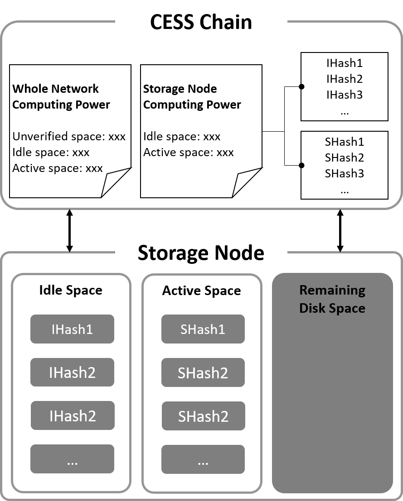
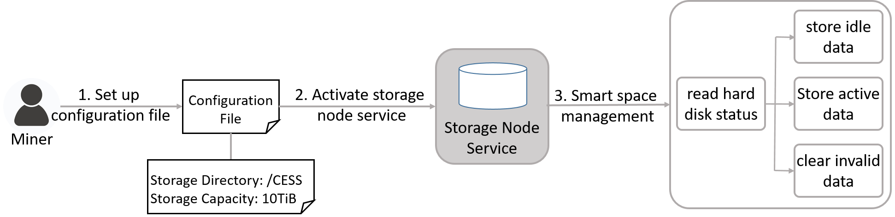

This section describes how storage space in the CESS network is classified and managed.

# Space Classification

The storage space in the CESS network is divided into three classes: unverified space, idle space, and active space.

**Unverified Space**: Unverified space refers to the space reported by the storage node itself, which the miner specifies through its setup configuration to indicate how much space from the hard disk can be used by the CESS network. The larger the specified space, the more CESS tokens are staked. However, this portion of unverified space does not bring any rewards.

**Idle Space**: Idle space is verified space. It is the space that can be purchased to store user data. It keeps *idle files* and earns rewards.

**Active Space**: Active space is also verified space. It earns more rewards for a storage node than idle space.

# Network Space Management

CESS storage is a globally distributed network, with each storage node providing unequal storage and computing power. CESS proposed a space management mechanism that reports all storage nodes' spaces to the chain to ensure that the data in storage nodes are verifiable. The chain manages the spaces to prevent storage nodes from committing malicious acts.

The space management mechanism is divided into three stages:

1. **Filling Stage**: A storage node searches for a TEE worker to fill its space. TEE worker generates unique and verifiable data for the storage node, called idle data. The storage node then reports the data hash to the CESS chain, marking the idle space on-chain.

2. **Usage Stage**: When a storage node has idle space, it can receive user data for storage. The data will be dissected to the same size as its idle data. Once the storage node confirms that the user data has been successfully stored, it will delete the idle space of the same size and report this action to the CESS chain. The CESS chain then records the increased active space and decreased idle space of the storage node.

3. **Challenge Stage**: When a storage node has idle or active space, the CESS chain will challenge it in random intervals. The storage node must complete the corresponding data challenge within a specified time and report the proof to the CESS chain. The CESS chain will verify the proof, reward the storage node if it passes the verification, and slash the storage node if it fails.

# Storage Node Space Management

The CESS node module regularly checks the status of the node hard drive and monitors the available and used space on the hard drive. It also verifies the data on the storage node. The action serves two purposes:

1. Ensure that the storage node does not occupy space that exceeds the configured capacity for the hard disk. When the available hard disk space is less than 2GB, the storage node will still stop storing idle data even if the configured capacity is not reached.

2. Regularly clean up invalid data, including malformed data, expired cache, and data that fail challenges to ensure that the data stored in the storage node is valid.


Please do not store your own data under the working directory specified for storage nodes to prevent data from being cleared.


Before storing idle data, the storage node will read its hard disk status. Only when the available space of the hard disk is greater than 2GB, and the configured capacity has yet to reach, can the storage of idle data earn some rewards. After storing user data, the node randomly selects idle data for deletion and reports the event to the network.

The storage node will periodically clear invalid data, and users can also manually run the clear command `bucket tidy`. This command identifies all files under the configuration directory and deletes data that do not meet the format or size requirements.
