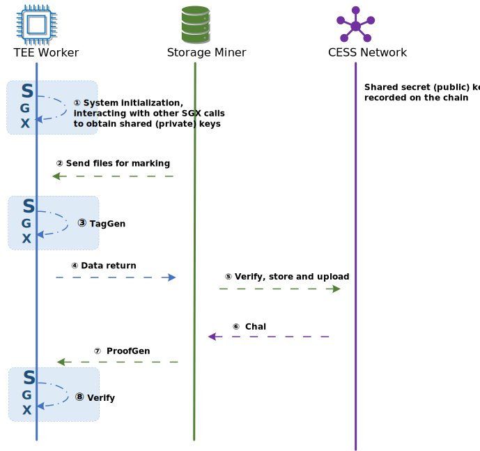


Work in Progress


# Definition

CESS has designed a trusted continuity proof mechanism based on cryptography that regularly verifies data availability through interactive audit responses without retrieving the stored data. It includes the following features:

- **Managed Continuity Proof**: the data owner is no longer bound to any computational overhead, such as data preprocessing. The data owner only needs to complete the data upload to obtain the managed periodic data integrity audit services.

- **Support of Integrity Audit for Multiple Data Backups**:  Through TLS, the data owner passes the key to a trusted environment (i.e., Intel SGX) and encrypts it to defend against Outsourcing Attacks and Sybil Attacks.

- **Scalable, Lightweight Solution**: A lightweight solution is designed by transferring most of the computing load of TEE workers to storage nodes. It significantly reduces the burdens on TEE workers and improves the scalability of the entire system.

- **Aggregation Proof and Public Verification**: All TEE workers in our scheme share the same pair of signature keys, so the storage node can generate aggregated proofs for large amounts of data and support public verification.

- **Key Revocation and Update**: Although a trusted environment can maximize the privacy of shared keys, it is still necessary to make contingency plans for key leakage. We further enhance the system's robustness by adding a lightweight solution that enables direct signature updates to stored data.

- **Data Dynamism**: Data owners can update outsourced data.

# Algorithm Description

The algorithm of the Trusted Continuous Proof mechanism is described as follows.

- **Setup**: System initialization. The enclave of TEE Worker generates public and private parameters.
- **TagGen**: Enclave of TEE worker is responsible for processing file `F` and generating a tag in a signed format for later proof generation and verification. TEE worker sends the output parameters and file `F` to the storage node for storage. The process of calling this algorithm is also known as "marking".
- **Chal**: Each time a random challenge is initiated, the network randomly selects a consensus node for execution in each cycle and generates challenge parameters for data segments on the entire network.
- **ProofGen**: The storage nodes calculate the proof based on the challenge parameters.
- **Verify**: TEE worker verifies the proof result.

In addition to the above basic operations, the trusted continuous proof mechanism supports aggregation proof and batch verification functions.

- **AggProofGen**: Storage nodes calculate proof based on challenge information and all files being challenged.
- **BatchVerify**: TEE Worker batch validates proof results.

# Algorithm Flow

## TEE Worker Enters The Network

During system initialization, a TEE worker eclave, the trusted environment, invokes the system initialization algorithm `Setup` to obtain the shared secret (private) key. According to the sequence of TEE workers entering the network, there are the following two types:

- The first node entering the network: The consensus node connects to the blockchain network, and the TEE worker initializes `Setup` to generate a shared secret key pair. Among them, the private key `sk` is saved, and the public key `pk` is uploaded to the chain.

- Subsequent node entering the network: Consensus nodes connect to the blockchain network after the first node. Their TEE workers obtain the shared secret (private) key `sk` from other TEE workers that have entered the network through a secure channel.

## Trusted Marking

1. The storage node first sends data to the TEE worker for marking.
2. After receiving the data that needs to be marked, the TEE worker passes the data into the enclave and invokes the **TagGen** algorithm to return the output parameters and file to the storage node.
3. After verification, the storage node stores the processed file locally and updates the on-chain status.

## Continuous Challenge Verification

1. When the blockchain network initiates a challenge, the **Chal** algorithm is called to output the challenge information.
2. After the storage node reads the challenge information of this round, it calls the **AggProofGen** algorithm to generate the aggregation proof and send it to the TEE worker.
3. After receiving this round of certification, TEE Worker calls **BatchVerify** algorithm to verify the results.

# Extended Reading

1. [Introducing Probable Data Possession](https://dl.acm.org/doi/abs/10.1145/1315245.1315318)

2. [Introducing Proofs of Retrievability](https://link.springer.com/article/10.1007/s00145-012-9129-2)
