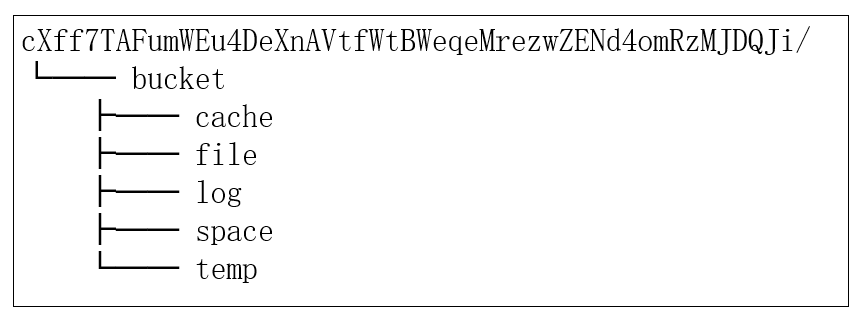

This section describes the data classification, attributes, and storage methods.

# Data Attributes

CESS is an object-based storage service where all data includes two types of attributes: metadata and data content.

- **Metadata**: It is a description of data content, including data length, data unique identifier, data owner, data location index, etc. The structure of the metadata is defined below:

    ```rust
    pub struct FileInfo<T: Config> {
        pub(super) completion: BlockNumberOf<T>,
        pub(super) stat: FileState,
        pub(super) segment_list: BoundedVec<SegmentInfo<T>, T::SegmentCount>,
        pub(super) owner: BoundedVec<UserBrief<T>, T::OwnerLimit>,
    }

    pub struct SegmentInfo<T: Config> {
        pub(super) hash: Hash,
        pub(super) fragment_list: BoundedVec<FragmentInfo<T>, T::FragmentCount>,
    }

    pub struct FragmentInfo<T: Config> {
        pub(super) hash: Hash,
        pub(super) avail: bool,
        pub(super) miner: AccountOf<T>,
    }

    pub struct UserBrief<T: Config> {
        pub user: AccountOf<T>,
        pub file_name: BoundedVec<u8, T::NameStrLimit>,
        pub bucket_name:  BoundedVec<u8, T::NameStrLimit>,
    }

    pub enum FileState {
        Active,
        Calculate,
        Missing,
        Recovery,
    }
    ```

- **Data Content**: the data itself.

# Storage Method

All metadata will be stored in the blockchain network, and there will also be backups in the cache of the storage node. The data content will eventually be stored in the storage node and stored on the disk as a file. The file name is the content's hash value, which is calculated using the [SHA-256](https://wikipedia.org/wiki/SHA-2) hash function.

The following figure shows the file directory structure after running the storage node. The directory is located in the user-specified folder in the configuration file and has three levels of directory structure. The first level is the name of the storage node's signature account, the second is the `bucket`, and the third includes `cache`, `file`, `log`, `space`, and `temp` directories. The `space` directory stores idle data, while the `file` directory stores active data.


