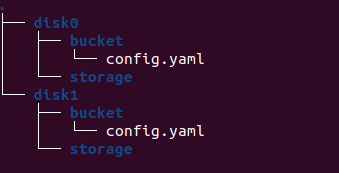

# 1. Prepare RPC node

You have the option to run your own RPC node on your machine, or use the RPC node officially provided by CESS.

To run your own RPC node, there are two ways: First is to start through the cess-nodeadm program, The second is to directly run the cess-node program. Below, we introduce both operating methods.

## Run RPC nodes through the cess-nodeadm program

1. Check the latest version of cess-nodeadm.

   The latest cess-nodeadm can be found here：<https://github.com/CESSProject/cess-nodeadm/tags>

   ⚠️In the rest of this section, all occurrences of x.x.x will be replaced with the latest version number. For instance, if the latest version is v0.5.3, then x.x.x shall be replaced by 0.5.3.

2. Check installed cess-nodeadm version.

   Enter the cess version command in the console to check whether the nodeadm version is the latest version.

   - If nodeadm version is the latest version, you can skip step 3.
   - If the nodeadm version is not the latest, proceed to step 3 for installation.
   - If you do not see the nodeadm version, it indicates that cess-nodeadm has not been installed. Proceed to step 3 to install it.

3. Download and install the cess-nodeadm program

   ```bash
   wget https://github.com/CESSProject/cess-nodeadm/archive/vx.x.x.tar.gz
   tar -xvf vx.x.x.tar.gz
   cd cess-nodeadm-x.x.x/
   ./install.sh
   ```

4. Stop the cess-node service
   Stop service command：`cess stop chain`

5. Select script configuration parameters

   ```plain
   cess config set

   press enter to skip): watcher
   Enter cess node name (current: cess, press enter to skip): local-chain
   enter to skip): archive #number of blocks saved 
   ```

6. Start local chain node
   ```bash
   cess start chain
   ```

7. Check whether the chain node synchronizes blocks normally
   ```bash
   docker logs chain
   ```

## Run the cess-node program directly

1. Install rust environment.

    Refer to the [official tutorial of Substrate](https://docs.substrate.io/install/)

2. Get the latest release version of cess-node

   Check the [latest version of cess-node](https://github.com/CESSProject/cess/tags)

   As an example, assuming `v0.7.5` is the latest version, download and decompress the cess-node program:

   ```bash
   wget https://github.com/CESSProject/cess/archive/v0.7.5.tar.gz
   tar -zxvf v0.7.5.tar.gz
   ```

3. Compile cess-node program

   Enter the cess-node directory：

   ```bash
   cd cess-0.7.5/
   cargo build --release
   ```

4. Start RPC service

   ```bash
   # Prior to version 0.7.5, include version 0.7.5 as input.
   ./target/release/cess-node --base-path <Your customized database storage path> --chain cess-testnet --port 30333 --ws-port 9944 --rpc-port 9933 --unsafe-rpc-external --unsafe-ws-external --name <your customized name> --rpc-cors all --ws-max-connections 2020 --state-pruning archive

   # Enter after version 0.7.5：
   ./target/release/cess-node --base-path <Your customized database storage path> --chain cess-testnet --port 30333 --rpc-port 9944 --unsafe-rpc-external --name <Your customized name> --rpc-cors all --rpc-max-connections 2020 --state-pruning archive
   ```

   If the node is generating a block synchronization log, it signifies a successful operation.

   ⚠️You need to keep the cess-node program running all the time. It is recommended to run cess-node command on a separate window [**screen**](https://linuxize.com/post/how-to-use-linux-screen/) or [**tmux**](https://linuxize.com/post/getting-started-with-tmux/).

# 2. Install Docker and Docker Compose

Using ubuntu (officially recommended storage node operating system) as an example to install docker.

Also refer to the Docker [installation documentation](https://docs.docker.com/engine/install/).

1. Update system package list

   ```bash
   sudo apt update
   ```

2. Install necessary dependencies:

   ```bash
   sudo apt install apt-transport-https ca-certificates curl    software-properties-common
   ```

3. Add Docker GPG key：

   ```bash
   curl -fsSL https://download.docker.com/linux/ubuntu/gpg | sudo gpg --dearmor -o /usr/share/keyrings/docker-archive-keyring.gpg
   ```

4. Set up Docker repository：

   ```bash
   echo "deb [arch=amd64 signed-by=/usr/share/keyrings/docker-archive-keyring.gpg] https://download.docker.com/linux/ubuntu $(lsb_release -cs) stable" | sudo tee /etc/apt/sources.list.d/docker.list > /dev/null
   ```

5. Update package index and install Docker engine：

   ```bash
   sudo apt update
   sudo apt install docker-ce docker-ce-cli containerd.io
   ```

6. Add the current user to the docker group so that you do not need to use the sudo command to run docker. It will take effect after restarting:

   ```bash
   sudo usermod -aG docker $USER
   ```

# 3. Configure Storage Node Information

1. Create a working directory for each storage node (for example: when running two storage nodes, the data directories of the two stored programs are located at `/mnt/disk0` and `/mnt/disk1` respectively. You can modify them to your own directories.)：

   ```bash
   cd /mnt/disk0/
   mkdir bucket storage
   cd /mnt/disk1/
   mkdir bucket storage
   ```

   The bucket directory is used to store storage node configuration files, and the storage directory is used as the working directory for storage node operation;

2. Create a 'config.yaml' file in the bucket directory of each storage node and paste the following content:

   ```yaml
   # The rpc endpoint of the chain node
   Rpc:
     - "ws://127.0.0.1:9944/"
   # Bootstrap Nodes
   Boot:
     - "_dnsaddr.boot-bucket-testnet.cess.cloud"
   # Signature account mnemonic
   Mnemonic: "xxx xxx ... xxx"
   # Staking account
   # If you fill in the staking account, the staking will be paid by the staking account,
   # otherwise the staking will be paid by the signature account.
   StakingAcc: "cXxxx...xxx"
   # earnings account
   EarningsAcc: cXxxx...xxx
   # Service workspace
   Workspace: "/opt/bucket-disk"
   # P2P communication port
   Port: 4001
   # Maximum space used, the unit is GiB
   UseSpace: 2000
   # Number of cpu's used, 0 means use all
   UseCpu: 4
   # Priority tee list address
   TeeList:
     - "127.0.0.1:8080"
     - "127.0.0.1:8081"
   ```

   It should be noted that each storage node should be set up with different working accounts, working paths and ports, etc.

   Please note that when configuring RPC, the first one is the local RPC node address. If you use the third type, you only need to configure the external RPC address. The address displayed in `Boot` is the storage node, boot node, and node address officially provided by CESS.

3. The storage node directory where the configuration file is configured should be as shown in the figure below：

   

# 4. Configure and start the storage node container

Please create the `docker-compose.yaml` file according to the following content to start storage node containers in batches：

```yaml
version: '3'
name: cess-storage
services:
  bucket_0: #services name
    image: 'cesslab/cess-bucket:testnet'
    network_mode: host
    restart: always
    volumes: #Mapping of host disk to container
      - '/mnt/disk0/bucket:/opt/bucket' #Node configuration directory
      - '/mnt/disk0/storage/:/opt/bucket-disk' #Node working directory
    command:
      - run
      - '-c'
      - /opt/bucket/config.yaml
    logging:
      driver: json-file
      options:
        max-size: 500m
    container_name: bucket0 #container name
  bucket_1:
    image: 'cesslab/cess-bucket:testnet'
    network_mode: host
    restart: always
    volumes:
      - '/mnt/disk1/bucket:/opt/bucket' #Node configuration directory
      - '/mnt/disk1/storage/:/opt/bucket-disk' #Node working directory,
    command:
      - run
      - '-c'
      - /opt/bucket/config.yaml
    logging:
      driver: json-file
      options:
        max-size: 500m
    container_name: bucket1
  watchtower: #only needs to be run once
    image: containrrr/watchtower
    container_name: watchtower
    network_mode: host
    restart: always
    volumes:
      - '/var/run/docker.sock:/var/run/docker.sock'
    command:
      - '--cleanup'
      - '--interval'
      - '300'
      - '--enable-lifecycle-hooks'
      - chain
      - bucket
    logging:
      driver: json-file
      options:
        max-size: 100m
        max-file: '7'
```

In the above file, set up a storage node service for each running storage node container. The yaml file is indented by two spaces to indicate the hierarchical relationship. For example, in the above file, two services, `bucket_0` and `bucket_1`, are configured. In each service, it is necessary to focus on configuring the service name, container name and directory mapping from the host to the container; such as in `bucket_0`, the directory mapping configuration is as follows：

```yaml
    volumes: #Mapping of host disk to container
      - '/mnt/disk0/bucket:/opt/bucket' #Node configuration directory
      - '/mnt/disk0/storage/:/opt/bucket-disk' #Node working directory
```

Among them, `/mnt/disk0/bucket/` is the previously created directory to store the configuration file of node 0, which contains config.yaml. `/mnt/disk0/storage/` is the working directory for storage node 0 created previously;

The `watchtower` service is used to monitor the status of each storage node container and automatically update the latest image for the container. Each server only needs to configure one of this service;

You can place the `docker-compose.yaml` file anywhere accessible. After configuring the file, run the `docker compose up -d` command to start the storage node container.

You can check the running status of the storage node through the `docker ps -a` command.
