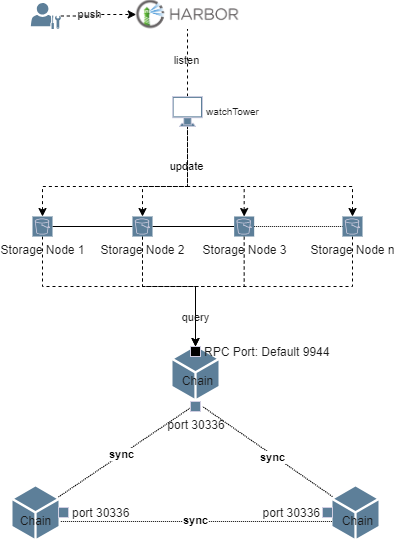

# Architecture

Install multi-buckets container can be illustrated as below:



# Run multi-buckets containers with admin client

## 1. Download and install cess-multibucket-admin client

```bash
sudo wget https://github.com/CESSProject/cess-multibucket-admin/archive/v0.0.1.tar.gz
sudo tar -xvf v0.0.1.tar.gz
cd cess-multibucket-admin-0.0.1
sudo bash ./install.sh
```

## 2. Customize your own configuration

After executing the above installation command, customize your own config file at: `/opt/cess/multibucket-admin/config.yaml`

   ```yaml
   ## node configurations template
   node:
      ## the mode of node: multibucket
      mode: "multibucket"
      ## the profile of node: devnet/testnet/mainnet
      profile: "testnet"
      # default chain url for bucket, this config will be overwritten in buckets[] as below
      chainWsUrl: "ws://127.0.0.1:9944/"
      # default backup chain urls for bucket, this config will be overwritten in buckets[] as below
      backupChainWsUrls: ["wss://testnet-rpc0.cess.cloud/ws/", "wss://testnet-rpc1.cess.cloud/ws/", "wss://testnet-rpc2.cess.cloud/ws/"]

   ## chain configurations
   ## set option: '--skip-chain' or '-s' to skip installing chain
   ## if set option: --skip-chain, please set official chain in bucket[].chainWsUrl
   chain:
      ## the name of chain node
      name: "cess"
      ## the port of chain node
      port: 30336
      ## listen rpc service at port 9944
      rpcPort: 9944

   ## bucket configurations  (multi storage miner mode)
   buckets:
      - name: "bucket_1"
        # P2P communication port
        port: 15001
        # Maximum space used, the unit is GiB
        UseSpace: 1000
        # Number of cpu's used, 0 means use all
        UseCpu: 2
        # earnings account
        earningsAcc: "cXxxxxxxxxxxxxxxxxxxxxxxxxxxxxxxxxxxxxxxxxxxxxxxx"
        # Staking account
        # If you fill in the staking account, the staking will be paid by the staking account,
        # otherwise the staking will be paid by the signature account.
        stakingAcc: "cXxxxxxxxxxxxxxxxxxxxxxxxxxxxxxxxxxxxxxxxxxxxxxxx"
        # Signature account mnemonic
        # each bucket's mnemonic should be different
        mnemonic: "aaaaa bbbbb ccccc ddddd eeeee fffff ggggg hhhhh iiiii jjjjj kkkkk lllll"
        # a directory mount with filesystem
        diskPath: "/mnt/cess_storage1"
        # The rpc endpoint of the chain
        # `official chain: wss://testnet-rpc0.cess.cloud/ws/ wss://testnet-rpc1.cess.cloud/ws/ wss://testnet-rpc2.cess.cloud/ws/`
        chainWsUrl: "ws://127.0.0.1:9944/"
        backupChainWsUrls: []
        # Priority tee list address
        TeeList:
           - "127.0.0.1:8080"
           - "127.0.0.1:8081"
        # Bootstrap Nodes
        Boot: "_dnsaddr.boot-bucket-testnet.cess.cloud"
        
      - name: "bucket_2"
        # P2P communication port
        port: 15002
        # Maximum space used, the unit is GiB
        UseSpace: 1000
        # Number of cpu's used
        UseCpu: 2
        # earnings account
        earningsAcc: "cXxxxxxxxxxxxxxxxxxxxxxxxxxxxxxxxxxxxxxxxxxxxxxxx"
        # Staking account
        # If you fill in the staking account, the staking will be paid by the staking account,
        # otherwise the staking will be paid by the signature account.
        stakingAcc: "cXxxxxxxxxxxxxxxxxxxxxxxxxxxxxxxxxxxxxxxxxxxxxxxx"
        # Signature account mnemonic
        # each bucket's mnemonic should be different
        mnemonic: "lllll kkkkk jjjjj iiiii hhhhh ggggg fffff eeeee ddddd ccccc bbbbb aaaaa"
        # a directory mount with filesystem
        diskPath: "/mnt/cess_storage2"
        # The rpc endpoint of the chain
        # `official chain: wss://testnet-rpc0.cess.cloud/ws/ wss://testnet-rpc1.cess.cloud/ws/ wss://testnet-rpc2.cess.cloud/ws/`
        chainWsUrl: "ws://127.0.0.1:9944/"
        backupChainWsUrls: [ ]
        # Priority tee list address
        TeeList:
           - "127.0.0.1:8080"
           - "127.0.0.1:8081"
        # Bootstrap Nodes
        Boot: "_dnsaddr.boot-bucket-testnet.cess.cloud"
   ```

## 3. Generate configuration and install multi-buckets
   
- Generate each bucket configuration at `$diskPath/bucket/config.yaml`
- Generate docker-compose.yaml at `/opt/cess/multibucket-admin/build/docker-compose.yaml`

   ```bash
   sudo cess-multibucket-admin config generate && sudo cess-multibucket-admin install
   ```

## 4. Uninstall

Stop one container
```bash
  sudo cess-multibucket-admin stop $1
```

Stop all containers
```bash
  sudo cess-multibucket-admin stop
```

Stop and remove all containers
```bash
  sudo cess-multibucket-admin down
```


# Run multi-buckets containers manually

## 1. Prerequisites

### I. PRC Node
To set up a multi-bucket environment, you must have an RPC node. You can either set it up locally or utilize the nodes officially provided by CESS. 

- To set up an RPC node locally please follow [Running RPC Node](../ref/ops/running-rpc-node.md)
- CESS officially hosted RCP nodes
  
   ```
   wss://testnet-rpc0.cess.cloud/ws/
   wss://testnet-rpc1.cess.cloud/ws/
   wss://testnet-rpc2.cess.cloud/ws/
   ```

### II. Install Docker and Docker Compose

Using ubuntu (officially recommended storage node operating system) as an example to install docker.

Also refer to the Docker [installation documentation](https://docs.docker.com/engine/install/).

1. Update system package list

   ```bash
   sudo apt update
   ```

2. Install necessary dependencies:

   ```bash
   sudo apt install apt-transport-https ca-certificates curl    software-properties-common
   ```

3. Add Docker GPG key：

   ```bash
   curl -fsSL https://download.docker.com/linux/ubuntu/gpg | sudo gpg --dearmor -o /usr/share/keyrings/docker-archive-keyring.gpg
   ```

4. Set up Docker repository：

   ```bash
   echo "deb [arch=amd64 signed-by=/usr/share/keyrings/docker-archive-keyring.gpg] https://download.docker.com/linux/ubuntu $(lsb_release -cs) stable" | sudo tee /etc/apt/sources.list.d/docker.list > /dev/null
   ```

5. Update package index and install Docker engine：

   ```bash
   sudo apt update
   sudo apt install docker-ce docker-ce-cli containerd.io
   ```

6. Add the current user to the docker group so that you do not need to use the sudo command to run docker. It will take effect after restarting:

   ```bash
   sudo usermod -aG docker $USER
   ```

   
## 2. Configure Multi-bucket Storage Node

1. Create a working directory for each of the storage nodes. For instance, in a two instance of storage node configuration, if you would like to allocate two separate disks to each of the nodes you can create two separate directories and mount the desired disk on each of the directories. Here we have mounted disk0 to `/mnt/disk0` and disk1 to `/mnt/disk1`. You may modify the directory name as you like.

   ```bash
   cd /mnt/disk0/
   mkdir bucket storage
   cd /mnt/disk1/
   mkdir bucket storage
   ```

   Here, the `bucket` directory is used to store storage node configuration files, and the `storage` directory is used as the working directory for storage node operation.

2. Create a 'config.yaml' file in the bucket directory of each storage node and paste the following content:

   ```yaml
   # The rpc endpoint of the chain node
   Rpc:
     # - "ws://127.0.0.1:9944/"
     - wss://testnet-rpc0.cess.cloud/ws/
     - wss://testnet-rpc1.cess.cloud/ws/
     - wss://testnet-rpc2.cess.cloud/ws/

   # Bootstrap Nodes
   Boot:
     - "_dnsaddr.boot-bucket-testnet.cess.cloud"
   # Signature account mnemonic
   Mnemonic: "xxx xxx ... xxx"
   # Staking account
   # If you fill in the staking account, the staking will be paid by the staking account,
   # otherwise the staking will be paid by the signature account.
   StakingAcc: "cXxxx...xxx"
   # earnings account
   EarningsAcc: cXxxx...xxx
   # Service workspace
   Workspace: "/opt/bucket-disk"
   # P2P communication port
   Port: 4001
   # Maximum space used, the unit is GiB
   UseSpace: 2000
   # Number of cpu's used, 0 means use all
   UseCpu: 4
   # Priority tee list address
   TeeList:
   #  - "127.0.0.1:8080"
   #  - "127.0.0.1:8081"
   ```

   Please note that when configuring RPC, the first one `(ws://127.0.0.1:9944/)` is the local RPC node address. Use this address if you have chosen to set up your own RPC node. If you haven't set up your own RPC node, please use the officially provided PRC addresses.

   ⚠️  Make sure to update `Mnemonic`, `StakingAcc`, `EarningsAcc`, and `UseCpu`.

3. The directory structure for each of the storage nodes should be as shown in the figure below：

   

## 4. Configure and start the storage node container

Please create the `docker-compose.yaml` file with the following content to start storage node containers in batches, you can place this file anywhere accessible.

```yaml
version: '3'
name: cess-storage
services:
  bucket_0: # services name
    image: 'cesslab/cess-bucket:testnet'
    network_mode: host
    restart: always
    volumes: # Mapping of host disk to container
      - '/mnt/disk0/bucket:/opt/bucket' # Node configuration directory
      - '/mnt/disk0/storage/:/opt/bucket-disk' # Node working directory
    command:
      - run
      - '-c'
      - /opt/bucket/config.yaml # Make sure that config.yaml matches with the configuration file we created above.
    logging:
      driver: json-file
      options:
        max-size: 500m
    container_name: bucket0 # Container name
  bucket_1:
    image: 'cesslab/cess-bucket:testnet'
    network_mode: host
    restart: always
    volumes:
      - '/mnt/disk1/bucket:/opt/bucket' # Node configuration directory
      - '/mnt/disk1/storage/:/opt/bucket-disk' # Node working directory,
    command:
      - run
      - '-c'
      - /opt/bucket/config.yaml # Make sure that config.yaml matches with the configuration file we created above.
    logging:
      driver: json-file
      options:
        max-size: 500m
    container_name: bucket1
  watchtower: # Only needs to be run once
    image: containrrr/watchtower
    container_name: watchtower
    network_mode: host
    restart: always
    volumes:
      - '/var/run/docker.sock:/var/run/docker.sock'
    command:
      - '--cleanup'
      - '--interval'
      - '300'
      - '--enable-lifecycle-hooks'
      - chain
      - bucket
    logging:
      driver: json-file
      options:
        max-size: 100m
        max-file: '7'
```

In the above file, set up a storage node service for each running storage node container. Depending on the number of storage nodes you are configuring the number of services also needs to be added. In our example, we are setting up two services `bucket_0` and `bucket_1`. In each service, it is important to focus on configuring the service name, container name, and directory mapping from the host to the container; such as in `bucket_0`, the directory mapping configuration is as follows：

```yaml
volumes: # Mapping of host disk to container
  - '/mnt/disk0/bucket:/opt/bucket' # Node configuration directory
  - '/mnt/disk0/storage/:/opt/bucket-disk' # Node working directory
```

Among them, `/mnt/disk0/bucket/` is the previously created directory to store the configuration file `config.yaml`, and `/mnt/disk0/storage/` is the working directory for storage node 0.

The `watchtower` service is used to monitor the status of each storage node container and automatically update the latest image for the container. Each server only needs to configure one such service.

After configuring the file, run the following command to start the storage node containers.

```bash
docker compose up -d
```

You can check the running status of your docker containers by executing the following command 

```bash
docker ps -a
``` 

To check the logs for each of the storage nodes execute

```bash
# Replace <STORAGE_CONTAINER_NAME> with bucket0, bucket1
docker logs <STORAGE_CONTAINER_NAME> 
```

To check the status of the storage miner execute
```bash
# Replace <STORAGE_CONTAINER_NAME> with bucket0, bucket1
docker exec <STORAGE_CONTAINER_NAME> cess-bucket --config /opt/bucket/config.yaml stat
```

Similarly, you can execute all the bucket related commands 
```bash
docker exec <STORAGE_CONTAINER_NAME> cess-bucket --config /opt/bucket/config.yaml <COMMAND>
```