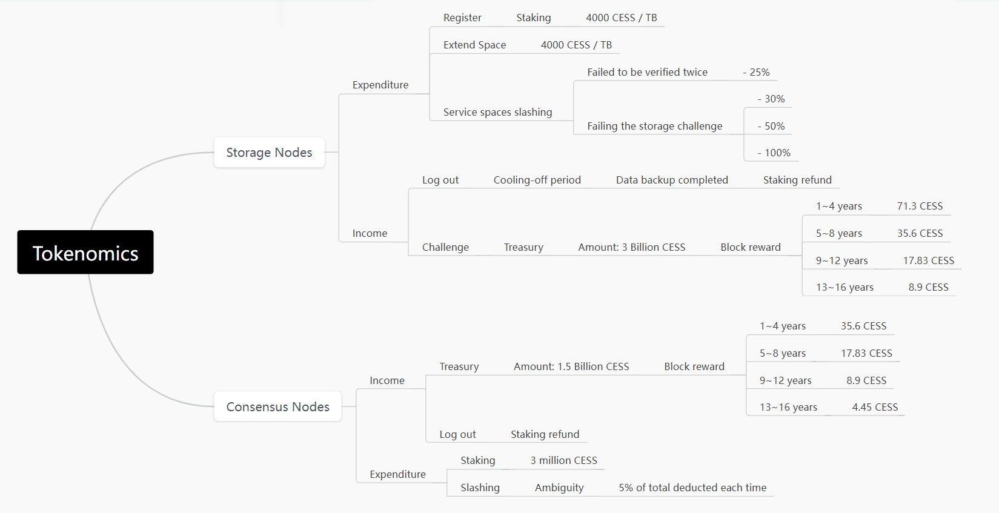

This is CESS overall tokenomics:

<figure><figcaption>
CESS Tokenomics
</figcaption></figure>

The CESS network issues a total of **10 billion tokens**, with **30% allocated as rewards for Storage Miners** and **15% for Consensus Miners**.

The total token issuance is halved every four years.

# Reward

For storage nodes, rewards are only granted when the storage miner completes a random audit challenge. The reward amount depends on the prize pool for that challenge round and the storage miner's proportion of storage power across the network. After rewards are distributed, storage nodes must initiate a transaction to claim the rewards.

The prize pool originates from a fixed quantity of coins generated by the network in each era. In the first four years, an average of 71 CESS tokens are issued per block, and this issuance amount is halved every four years.

The reward of a storage miner in _k-th_ round is determined based on:

- **TotalReward**: the total reward across the CESS network in _k-th_ round.
- **ServiceSpace**: the utilized space of the storage miner in _k-th_ round.
- **IdleSpace**: the idle space of the storage miner in _k-th_ round.
- **TotalStoragePower**: sum of all storage miner power in _k-th_ round.

$$\boxed{StoragePower_k = IdleSpace_k * 0.3 + ServiceSpace_k * 0.7}$$

$$\boxed{RewardOrder_k = TotalReward_k * \cfrac{StoragePower_k}{TotalStoragePower_k}}$$

Reward order is the reward for the storage miner in that round. Once the reward is determined, 20% of the reward order is distributed right away and the rest is distributed in the subsequent 180 rounds, each time 1/180 of the remaining amount.

The available reward for a storage miner in _k-th_ round is computed below:

$$\boxed{AvailableReward_k = (RewardOrder_k * 20\%) + \sum_{t=k-180}^{k-1} \cfrac{RewardOrder_t}{180}}$$

A reward order will be removed after fully distributed. So a storage miner can receive rewards from at most 181 orders.

Once a miner's reward is computed, it is stored in an aggregated pool. Miners need to send a transaction to retrieve the reward. They can choose to wait and retrieve the reward later in one go to save transaction fees.

# Slashing

Storage miners could be slashed if the following situations occurred, with their staked assets being deducted. The slashing amount depends on the slashing type and the storage miner's total idle and service spaces. There are two types of slashings: **Proving Slashes** and **Clearance Slashes**.

## Proving Slashes

The storage miner is being challenged twice. If the miner couldn't pass the verification of a TEE worker, it would receive a proving slash.

Slash Computation:

$$\boxed{StorageSpace = IdleSpace + ServiceSpace}$$

$$\boxed{SlashLimit = 4000\text{ \small{CESS/TB}} * StorageSpace\text{ \small{(in TB, round up to integer)}}}$$

That means the storage is counted as 1 TB even if less than that. If the service spaces failed to be verified twice consecutively, slash for **Slash Limit \* 25%**.

## Clearance Slashes

If a miner cannot complete a storage challenge, it will be slashed. Failing the storage challenge once, **Slash Limit \* 30%** will be deducted; failing twice consecutively, **Slash Limit \* 50%**; failing the third time consecutively, **Slash Limit \* 100%** will be deducted with the remaining staked amount returned and the node ejected from the storage node set.
