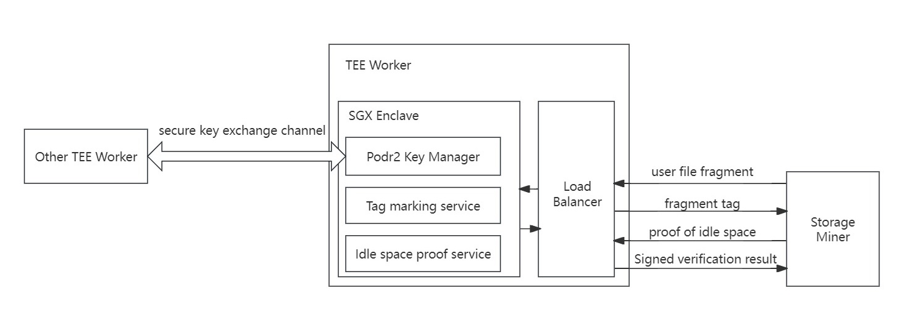

# TEE Worker Guide

## Introduction

The main task of TEE Worker is to mark data (generate file Tags) for files in PoDR² (Proof of Data Reduplication and Recovery), and to verify the space proof generated by storage miners in PoIS (Proof of Idle Space). Every job done in the TEE Worker is tamper-proof and verifiable, effectively ensuring the authenticity of the data.

TEE Worker is developed based on [Gramine library](https://gramineproject.io/) and currently only supports [Intel series chips](https://www.intel.com/content/www/us/en/developer/articles /tool/intel-trusted-execution-technology.html). TEE Workers can be divided into three types:

1. **Marker**: Dedicated to service data marking, idle space certification and idle space replacement.
2. **Verifier**: Dedicated to random challenge verification of service data and idle space, it can only be bound to consensus node registration.
3. **Full**: Full nodes, which are the union of Marker and Verifier functions, can only be bound to consensus node registration.

## Income Introduction

Running TEE Worker itself does not directly obtain any benefits, but obtains more rewards for its related nodes by performing effective security services of the storage network. TEE Worker has two deployment methods, each of which can obtain different benefits:

- It is bound to run with the consensus node and can only work after being bound and registered with the consensus node stash account. It requires relatively high hardware requirements, but its tied consensus miners will also receive higher rewards.

- Independent registration can run a specific type of TEE Worker without being bound to a consensus node, specifically marking data and verification space for specific storage miners to help storage miners obtain higher rewards from each random challenge.

## Why deploying independently registered TEE Workers bring more rewards to storage miners?

During random challenges, rewards will be divided based on the proportion of the user data (service data) effectively stored by storage miners and certified idle space in the entire network. User data needs to be marked by TEE Worker before it can pass the random challenge. Similarly, the idle space generated in batches by storage miners also needs to be verified by TEE Worker. However, the TEE Worker resources disclosed in the entire network are limited, and they need to queue up to receive the service. For storage miners with higher performance, this is often one of the main bottlenecks restricting their production efficiency. And due to limitations of regional network differences, storage nodes scattered around the world do not receive TEE Worker services equally efficiently. Therefore, in order to minimize the effect of this bottleneck and accelerate the verification of data across the entire network, CESS encourages users with a large number of storage miners to independently register and run several TEE Workers to verify their own nodes.

## Operation Guide

Running TEE Worker with **Marker** requires an account: the **Controller account**, and only one Gas fee for registering transactions. Please refer to [Create CESS Account](../community/cess-account.md), and go to [CESS Faucet](https://cess.cloud/faucet.html) to obtain TCESS, or [Contact Us](../introduction/contact.md) to obtain TCESS tokens.

After creating a wallet account, navigate to [CESS Browser](https://polkadot.js.org/apps/?rpc=wss%3A%2F%2Ftestnet-rpc0.cess.cloud%2Fws%2F#/explorer). To run other types of TEE Workers, please refer to [Consensus Node Deployment Guide](../consensus-miner/running.md).

### Install CESS Client

cess-nodeadm is a CESS node deployment and management program that helps deploy and manage storage nodes, consensus nodes, and full nodes to simplify development operations for all CESS miners.

``` shell
wget https://github.com/CESSProject/cess-nodeadm/archive/v0.5.x.tar.gz
tar -xvf v0.5.x.tar.gz
cd cess-nodeadm-0.5.x
sudo ./install.sh
```

Please check that you are using the latest version of cess-nodeadm. Currently it is version v0.5.3.
If the `Install cess nodeadm success` message appears, the installation was successful.
If the installation fails, review the troubleshooting steps.

### Configure CESS Client

Run `cess config set` command and configure it as follows:

```shell
cess config set
Enter cess node mode from 'authority/storage/watcher' (current: authority, press enter to skip): authority
Intel SGX is already enabled on this system
Enter cess node name (current: cess-test-node2-526824, press enter to skip): cess-test-node2
Enter cess chain ws url (current: wss://testnet-rpc0.cess.cloud/ws/, press enter to skip): ws://129.226.81.243:9944
Enter listener port for kaleido (current: 10010, press enter to skip):
Enter the kaleido endpoint (current: http://test.dm.com, press enter to skip): http://45.195.74.43:10010
Enter cess validator stash account (current: , press enter to skip): null
Your Tee worker will work as 'Marker'!
Enter cess validator controller phrase (current: level course inflict raise giant hammer blur run seed adjust ice goddess, press enter to skip):
Set configurations successfully
```

When setting up the validator stash account, fill in null and this will automatically configure it to Marker mode, and then enter the controller account (a work account used for TEE Worker registration, sending transactions, etc.) mnemonic phrase (account seed) to complete the configuration. Then enter the `cess start` command to start the Marker TEE Worker.

**Please note**: "kaleido endpoint" in the above configuration represents the access address of the TEE Worker you deployed. After the TEE Worker is running, you can add the address to the priority access list when running the storage miner, such as using a CESS client When configuring the storage miner on the end, configure it in "Enter the reserved TEE worker endpoints"; if you are directly running the storage miner manually, please configure it in list form in the "TeeList:" item in the configuration file of the storage miner.

## Working Principle

The working principle of Marker type TEE Worker is shown in the figure below:



TEE Worker protects the PoDR² key through the SGX Trusted Execution Environment, which is used to mark user service file fragments, and to verify and sign the results of idle space certification or replacement certification. The PoDR² key is generated in a trusted environment and transferred to the trusted environment of other TEE Workers through a secure key exchange channel without being leaked to the outside, thus ensuring the security of the algorithm; the trusted environment also encapsulates the internal code, and needs to pass Intel remote authentication. The remote authentication report also needs to be verified when TEE Worker is registered to ensure that the code running in SGX is officially disclosed by CESS and has not been maliciously tampered with, thereby ensuring the correctness of the service.

In addition, any user request parameters that enter SGX need to be verified to ensure that the data will not be tampered with during the process.
