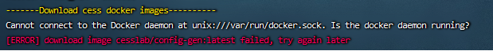
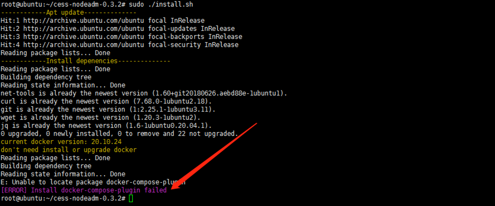
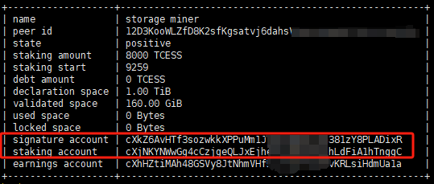
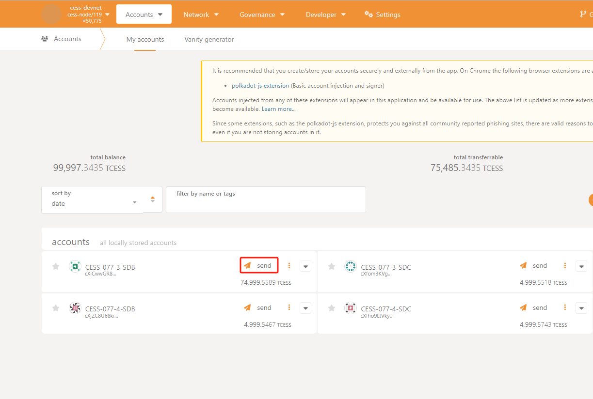
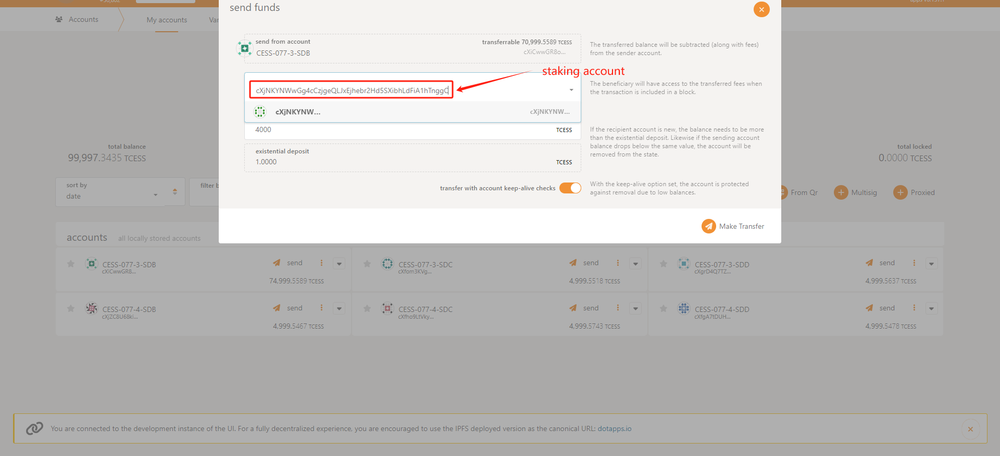
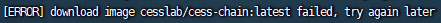
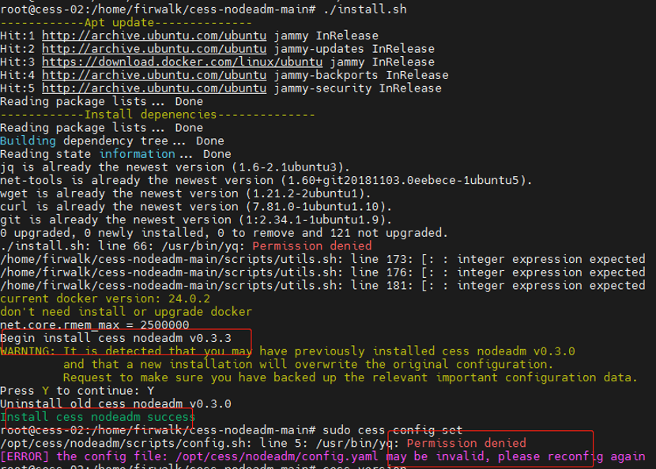

# Issues During Installation

<details>

<summary>Unable to download docker image</summary>

During the installation process, docker is used to download cess image. If the following error occurs when installing the `cess-nodeadm`:



Make sure commands are in the root privilege or prefixed with `sudo` command. Start docker on your system:

```bash
systemctl start docker
```

Reinstall the `cess-nodeadm`:

```bash
./install.sh
```

⚠️ Note that most CESS program commands must have root privileges.

</details>

<details>

<summary>Failed to locate docker package</summary>

If the following error occurs when installing the `cess-nodeadm`:



Try to delete Docker with following commands:

```bash
sudo systemctl stop docker
docker stop $(docker ps -aq)
docker rm -v $(docker ps -aq)
docker rmi $(docker images -aq)
docker volume rm $(docker volume ls -q)
brew uninstall docker
```

Reinstall Docker:

```bash
sudo apt-get install docker-ce
sudo systemctl enable docker
sudo systemctl start docker
```

</details>

# Issues After Installation

<details>

<summary>Increase Stake Manually</summary>

If signatureAcc different from stakingAcc is provided as below:


You can not increase stake by command with client:
```bash
sudo cess bucket increase staking $deposit_amount
# or
sudo cess-multibucket-admin buckets increase staking $bucket_name $deposit_amount

# Execute command as above might get message like: `!! 2024-03-28 13:22:18 0xxxxxxxxxxxxxxxxxxxxxxxxxxxxxxxxxxxxxxxxxxxxxxxxxxxxxxxxxx`
```

Try to access to [block browser](https://polkadot.js.org/apps/?rpc=wss%3A%2F%2Ftestnet-rpc0.cess.cloud%2Fws%2F#/accounts) and send TCESS manually

**Step 1**: Select an account which have sufficient TCESS, then click `send`


**Step 2**: Enter the staking account and amount, then click `Make Transfer`


**Step 3**: Finally, enter the password for the account you have selected that has sufficient TCESS.

</details>


# Issues During Configuration

<details>

<summary>Failed to download CESS image</summary>

If the following error occurs when setting up the config:



Ensure the commands are run in the root privilege or prefixed with `sudo` command.

Try `cess config set` command.

</details>

<details>

<summary>Invalid config file (config.yaml)</summary>



Delete file `/usr/bin/yq`:

```bash
sudo rm /usr/bin/yq
```

Reinstall `cess-nodeadm` again:

```bash
./install.sh
```

</details>
