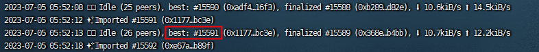
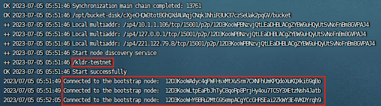
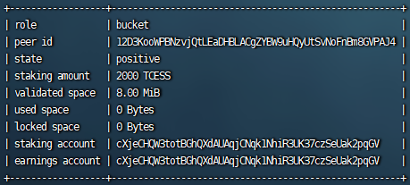

# Running a Storage Node

## Server Requirement

The recommended requirement of a storage server:

| Resource  | Specification |
| ------------- | ------------- |
| Recommended OS | Linux 64-bit Intel / AMD |
| # of CPU Cores | ≥ 4 |
| Memory | ≥ 8 GB |
| Bandwidth | ≥ 5 Mbps |
| Public Network IP | required |
| Linux Kernel Version | 5.11 or higher |

## Server Preparation

### Install Docker

Please refer to the [official documentation](https://docs.docker.com/engine/install/) for Docker installation.

### Firewall Configuration


**Info hints** The following commands are executed with root privileges. If error messages of `permission denied` appear, switch to root privilege or add `sudo` at the beginning of these commands.


By default, cess-bucket uses port 4001 to listen for incoming connections, if your platform blocks the port by default, you may need to enable the access to the port.

```bash
ufw allow 4001
```

### Disk Mounting

Check the hard disk status using the df -h command:

```bash
$ df -h
```

The disk is not mounted If the hard drive for storage mining cannot be found. Use the command below to view unmounted hard disks:

```bash
$ fdisk -l

Disk /dev/vdb: 200 GiB, 214748364800 bytes, 419430400 sectors
Units: sectors of 1 * 512 = 512 bytes
Sector size (logical/physical): 512 bytes / 512 bytes
I/O size (minimum/optimal): 512 bytes / 512 bytes
Disklabel type: dos
Disk identifier: 0x331195d1
```

From the above, the unmounted disk is `/dev/vdb`. We will be using `/dev/vdb` to demonstrate the mounting operation.

Allocate the `/dev/vdb` disk:

```bash
fdisk /dev/vdb
Enter and press Enter:
n
p
1
2048
the value after default
w
```

Format the newly divided disk into ext4 format:

```bash
mkfs.ext4 /dev/vdb
```

Enter "y" to continue if the system asks to proceed:

```
Proceed anyway? (y,N) y
```

Create `/cess` directory to mount the disk. Using `/cess` as an example:

```bash
mkdir /cess
echo "/dev/vdb /cess ext4 defaults 0 0" >> /etc/fstab
```

> replace /dev/vdb with your own disk name. /cess has to remain the same as created in the previous step. If you are not under root privileges, try:
> `echo "/dev/vdb /cess ext4 defaults 0 0" | sudo tee -a /etc/fstab`

Mount `/cess`:

```bash
mount -a
```

Check the disk mounting status:

```bash
df -h
```

If `/cess` appers, the disk has been successfully mounted.

### Prepare CESS Accounts

Miners need to create two wallet accounts.

- Earning account: Used for receiving rewards from mining.
- Staking account: Used for staking and signing blockchain transactions.

Please refer to the [CESS Account](../community/cess-account.md) for creating a CESS account, goto [CESS faucet](https://cess.cloud/faucet.html) to get TCESS, or [contact us](../introduction/contact.md) to get assistance.

## Install `cess-nodeadm`

```bash
wget https://github.com/CESSProject/cess-nodeadm/archive/v0.3.3.tar.gz
tar -xvf v0.3.3.tar.gz
cd cess-nodeadm-0.3.3/
./install.sh
```


Check the [most updated version of `cess-nodeadm`](https://github.com/CESSProject/cess-nodeadm/tags). Currently it is **v0.3.3**.


If a message `Install cess nodeadm success` shows up, the installation is successful.

If the installation fails, please check the [troubleshoot procedures](./troubleshooting.md).

## Config the Client

Run `cess config set`

```bash
$ cess config set

Enter cess node mode from 'authority/storage/watcher' (current: authority, press enter to skip): storage
Enter external ip for the machine: 173.....213.58
Enter cess bucket income account: cXiHsw32kT3Fzw6YeXDTECCfFNKjDVg85eg......
Enter cess bucket signature phrase: shoe ...... creek metal avoid
Enter cess bucket disk path (default: /opt/cess/storage/disk): /cess
Enter cess bucket space, by GB unit (current: 300, press enter to skip): 1000
Set configurations successfully
```

Start CESS bucket

```bash
$ cess start

[+] Running 3/0
 ✔ Container chain       Running                                                0.0s
 ✔ Container bucket      Running                                                0.0s
 ✔ Container watchtower  Running                                                0.0s
```

## Check CESS Chain Sync Status

View the chain node log

```bash
docker logs chain
```

As shown in the figure below, if we see that the height of the block corresponding to "best" is about the latest height in [CESS Explorer](https://testnet.cess.cloud/), it means the local chain node synchronization is completed.



Only when the chain synchronization is completed can you operate other functions such as increase the staking, view the status of the node, etc.

## Common Operations

**View the storage node log**

```bash
docker logs bucket
```

As shown in the figure below, seeing /kldr-testnet indicates that the network environment is a test network, and seeing Connected to the bootstrap node indicates that there is a connection to the bootstrap node.



**View bucket status**

```bash
cess bucket stat
```

An example of the returned results is shown below：



Refer to the [Glossary](../glossary.md) on the names above.

**Increase staking**

```bash
cess bucket increase <deposit amount>
```

**Withdraw staking**

After your node **has exited CESS Network** (see below), run

```bash
cess bucket withdraw
```

**Query reward information**

```bash
cess bucket reward
```

**Claim reward**

```bash
cess bucket claim
```

**Update all service images**

```bash
cess pullimg
```

**Stop and remove all service**

```bash
cess down
```

**Update earnings account**

```bash
cess bucket update earnings [earnings account]
```

**Exit CESS network**


**Warning hints** Please use this command carefully. Once you exit, you cannot resume.


```bash
cess bucket exit
```

## Upgrade Client

**Stop and remove all services**

```bash
cess stop
cess down
```

**Remove all chain data**


**Warning hints** Do not perform this operation unless the CESS network has been redeployed and it is confirmed that the data can be cleared.


```bash
cess purge
```

**Update `cess-nodeadm`**

```bash
wget https://github.com/CESSProject/cess-nodeadm/archive/<new-version>.tar.gz
tar -xvf <new-version>.tar.gz
cd cess-nodeadm-<new-version>
./install.sh --skip-dep
```

Currently [the most updated version](https://github.com/CESSProject/cess-nodeadm/tags) is **v0.3.3**.

**Pull images**

```bash
cess pullimg
```
