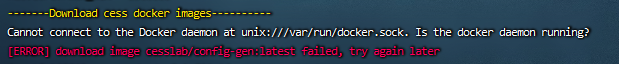
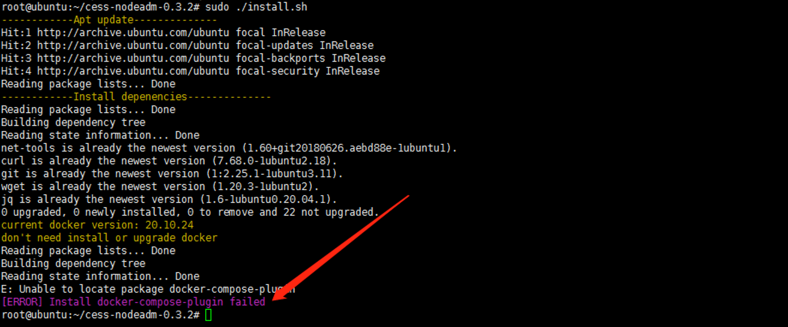
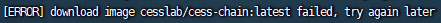
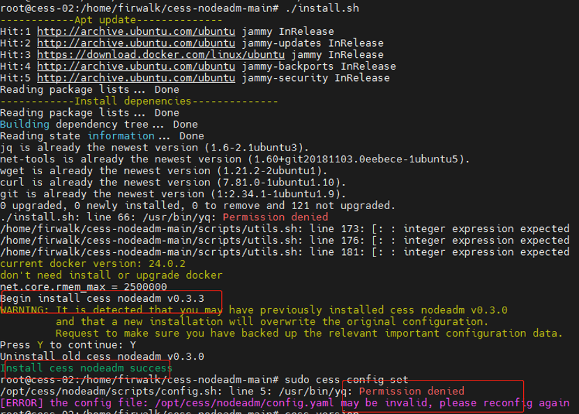

# Possible Issues During Installation

<details>
  <summary>Unable to download docker image</summary>

  During the installation process, docker is used to download cess image. If the following exception occurs when installing the `cess-nodeadm`:

  

  Make sure cmds are in the root privilege or with sudo command.
  Start docker on your system:

  ```bash
  systemctl start docker
  ```

  Reinstall the `cess-nodeadm`:

  ```bash
  ./install.sh
  ```

  ⚠️ Note that all CESS program commands must have sudo privileges.
</details>

<details>
  <summary>Failed to locate docker package</summary>

  If the following error occurs when installing the `cess-nodeadm`:

  

  Try to delete docker with following commands:

  ```bash
  sudo systemctl stop docker
  docker stop $(docker ps -aq)
  docker rm -v $(docker ps -aq)
  docker rmi $(docker images -aq)
  docker volume rm $(docker volume ls -q)
  brew uninstall docker
  ```

  Reinstall Docker:

  ```bash
  sudo apt-get install docker-ce
  sudo systemctl enable docker
  sudo systemctl start docker
  ```
</details>

# Possible Issues During Configuration

<details>
  <summary>Failed to download CESS image</summary>

  If the following error occurs when setting up the config:

  

  Make sure to run commands in the root privilege or with `sudo` command.

  Try `cess config set` command.
</details>

<details>
  <summary>Invalid config file (config.yaml)</summary>

  

  Delete file `/usr/bin/yq`:

  ```bash
  sudo rm /usr/bin/yq
  ```

  Reinstall `cess-nodeadm` again:

  ```bash
  ./install.sh
  ```
</details>
