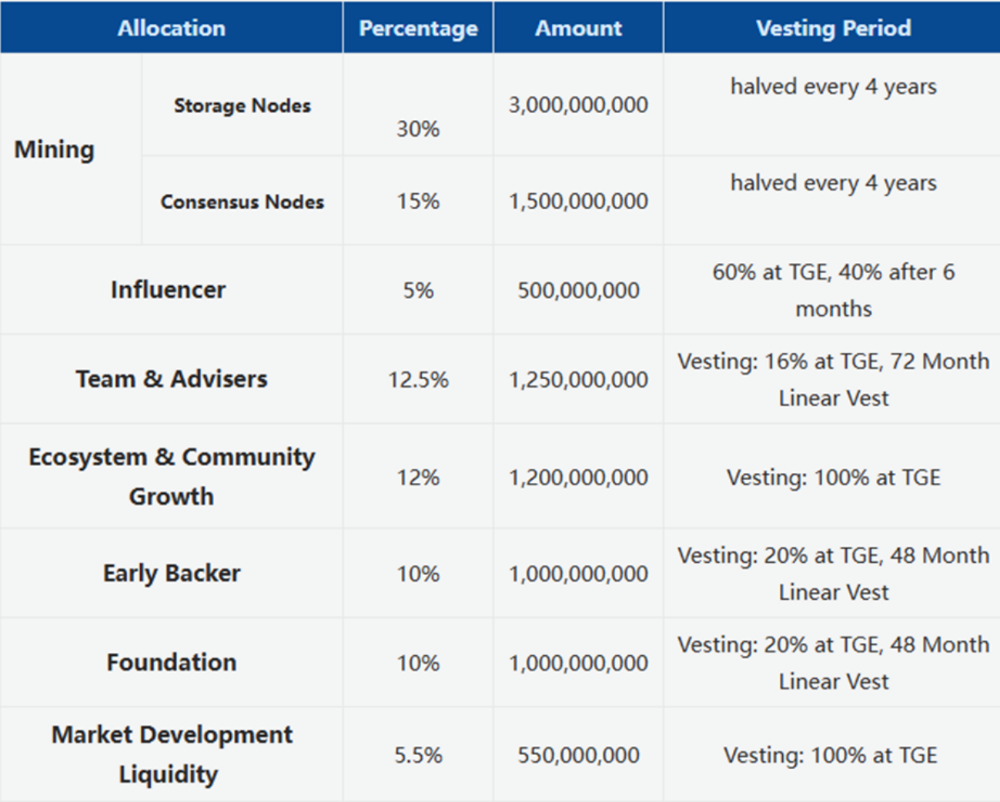

The total supply of CESS is 10 billion tokens. After the mainnet launched, 3.5 billion tokens will be generated at once in the Genesis block, while the remaining 6.5 billion will be gradually minted through block rewards. The block rewards are halved every four years, with an annual decay rate of 0.841, meaning that from the second year onward, the amount issued each year will be 84.1% of the previous year. Starting from the 31st year, the issuance will no longer decay, and the annual token output will remain fixed at the amount issued in the 30th year.

A new block is generated approximately every 6 seconds, and every 14,400 blocks (roughly every 24 hours) constitute a reward settlement cycle.

Before the CESS Network mainnet launch, an equivalent amount of the same-name tokens will be issued on the BNB Smart Chain. Once the mainnet launches, $CESS on BNB Smart Chain can be mapped for $CESS on the mainnet via a cross-chain bridge.

<figure><figcaption>
Token Distribution of CESS
</figcaption></figure>
