# Background

CESS testnet has been released. If users want to upload files, they need to purchase space and an authorized gateway first. This guide is for developers who want to interact directly with the chain through a blockchain browser to purchase territory, expand territory, and other operations.

## What is territory

To allow users to use the storage space of the CESS network more flexibly, we have decided to give the storage space the characteristics of NFTs, making it unique and tradable. This is intended to activate the network. We have thus introduced the concept of "CESS territory."

"Territory" replaces the previous concept of storage space, converting user-held space into user-held territory. The files uploaded by users will be uploaded to the territory they own.

Each user can have an unlimited number of "territories." Users can name each of their territories. At the same time, each territory has a unique token value for identification. Users can trade or transfer their territories using the territory token value. Since this is an expansion of the previous version of storage space, each territory will also have an expiration time. Users can renew and expand their existing territories through renewal or expansion.

# Guides

The guide will explain how to purchase territory, expand territory, renew territory, and some of the details.

## Buy Territory

1. After connecting to rpc node, the browser loads the blockchain information. We select Developer - Extrinsics as shown in the image below.

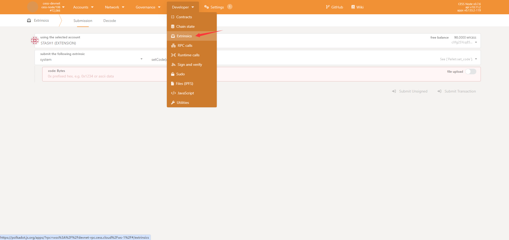

2. Select the `StorageHandler` module and select the `mintTerritory`.

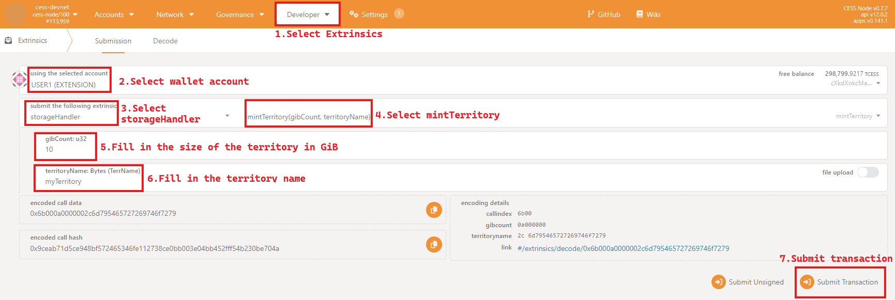

3. Click `Sign and Submit` to confirm the signature, Then wait for the browser to call the wallet to sign. After entering your customized password, click `Sign the transaction` to sign the transaction.

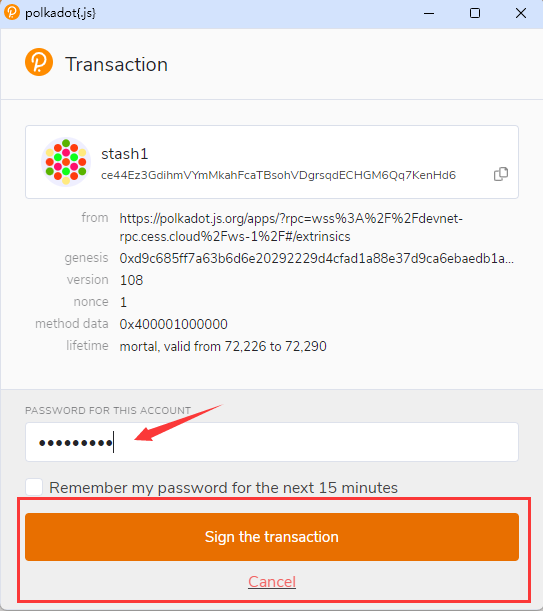

4. Wait for the transaction to be packaged and then broadcast the confirmation. If you see the content shown in Figure 2 below, it means that the transaction you submitted has been successfully executed.

        It should be noted that if your account has already purchased space, calling this transaction will fail. If you want to expand or renew the lease, please call the corresponding transaction.

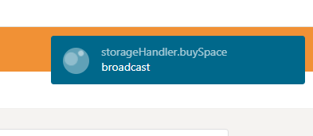

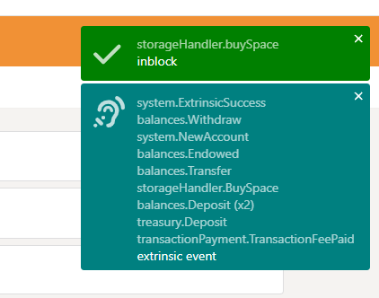

## Renewal Territory

1. Select `Developer -> Extrinsics -> StorageHandler` module, then select the `renewalTerritory`, after filling in the parameters `territoryName` and  `days` correctly, submit the transaction.

       `territoryName` is the name of the territory you have purchased.
       `days` is the increased validity period days.

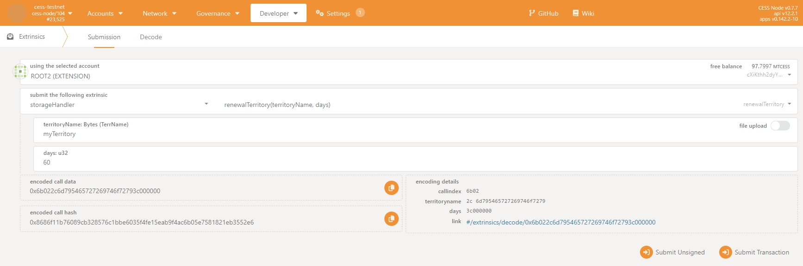

2. The subsequent operations are the same as purchasing space.

## Expand Territory

1. Select `Developer -> Extrinsics -> StorageHandler` module, then select the `expandingTerritory`, after filling in the parameters `territoryName` and  `gibCount` correctly, submit the transaction.

       `territoryName` is the name of the territory you have purchased.
       `gibCount` is the size of the expansion, in GiB.

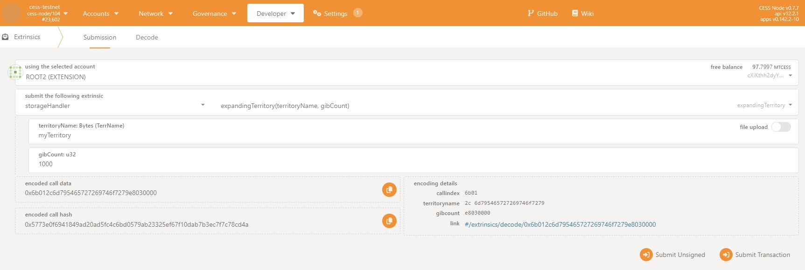

2. The subsequent operations are the same as purchasing space.

## Query Territory

1. Select `Developer -> Chain state -> StorageHandler` module, then select the `territory`, after filling in the parameters `AccountID32` and  `Bytes` correctly, click "+" to query. View the returned results.

       `AccountID32` is the account address where you purchased the territory.
       `Bytes` is the name of the territory.

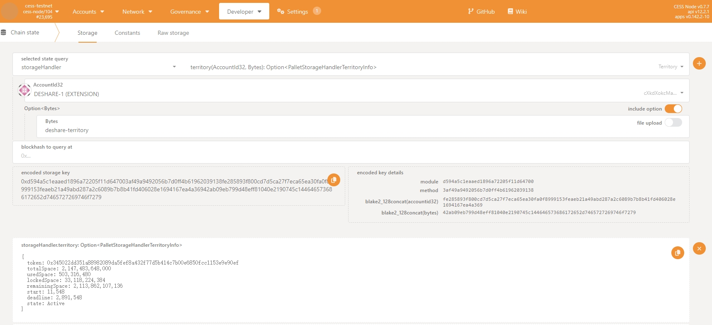

`token`: is the unique identifier of the territory.

`totalSpace`: Indicates the total space currently held by the user, in bytes.

`usedSpace`: Indicates the space currently used by the user, in bytes.

`lockedSpace`: Indicates the space used by the file currently being uploaded by the user, in bytes.

`remainingSpace`: Indicates the remaining space available to the user, in bytes.  

`start`: Block height when space is first purchased.

`deadline`: Block height at expiration.

`state`: The status of the space currently held by the user.

## Buy territory for others

1. To purchase territory for others, an arbitrary account must first create a purchase order. Select `Developer -> Extrinsics -> StorageHandler` module, then select the `createOrder` transaction. This transaction can be executed by any account, but a certain fee must be paid, and it can be used not only for purchasing but also for renewing and expanding. In our example, we will take purchasing as an example.

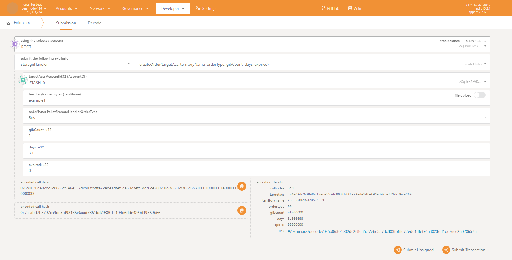

       targetAcc: Target account for purchase
       territoryName: The name of the territory for purchase/renewal/expansion.
       orderType: The type of this order is to choose for purchase/renewal/expansion.
       gibCount: The size of the territory for purchase/expansion.
       days: The validity period of the territory for purchase/renewal.
       expired: The validity time of the order, in sec.

2. After submitting the create order transaction, the event will return an orderId, which is the unique identifier of the order. To pay for this order, the orderId will be needed.

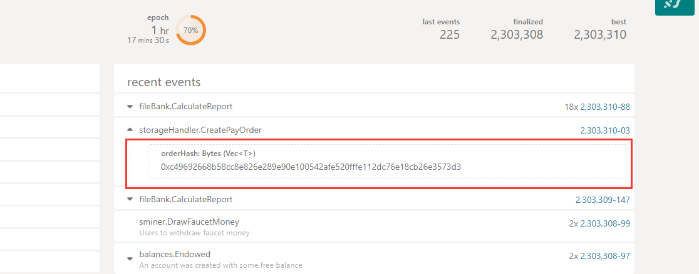

As shown in the figure, we obtained an order id of `0xc49692668b58cc8e826e289e90e100542afe520fffe112dc76e18cb26e3573d3`, and next we need to pay for this order.

3. Select `Developer -> Extrinsics -> StorageHandler` module, then select the `execOrder` transaction, and fill in the corresponding orderId. This step will deduct the tokens from the transaction account according to the order content and execute the order.

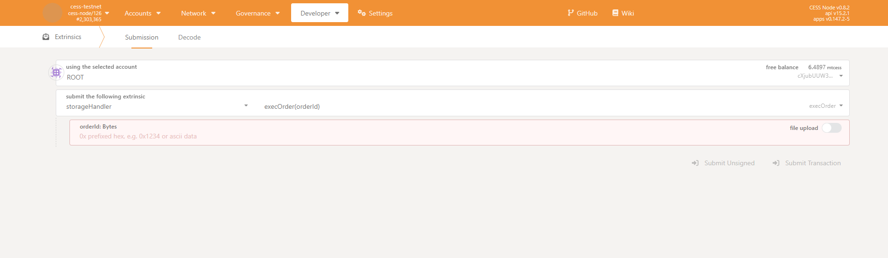

After the transaction is successfully executed, the operation of purchasing territory for others is completed.

